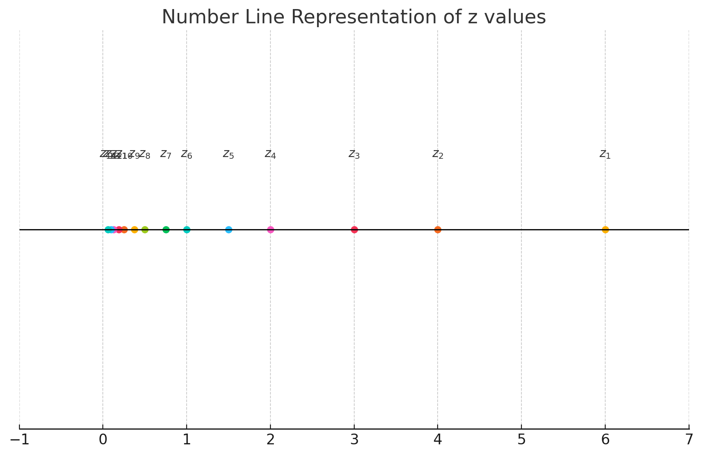
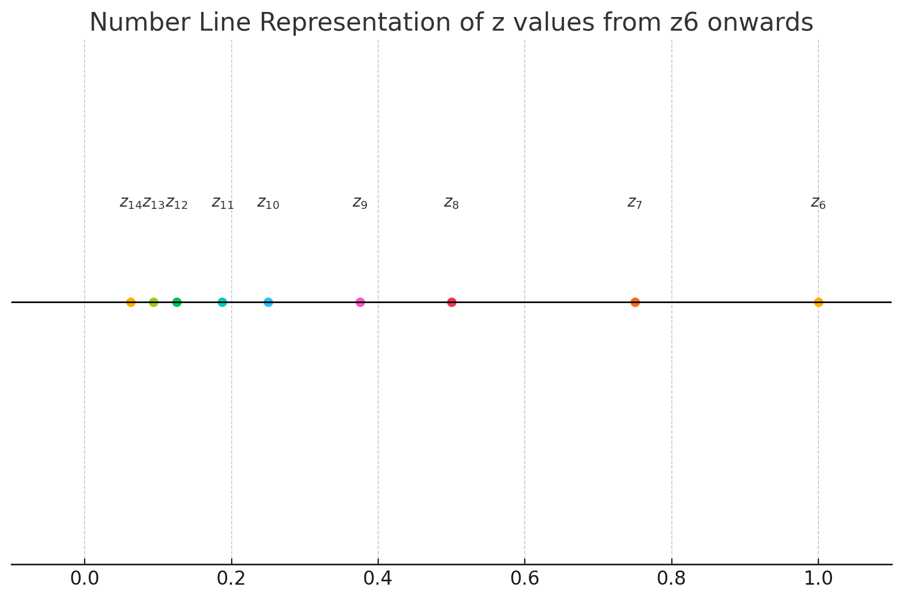
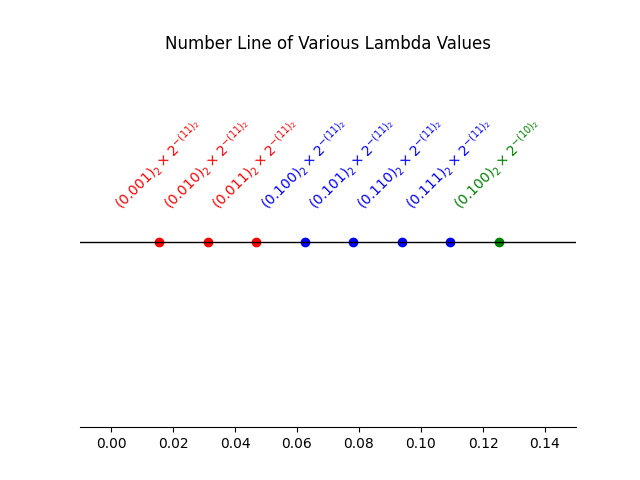
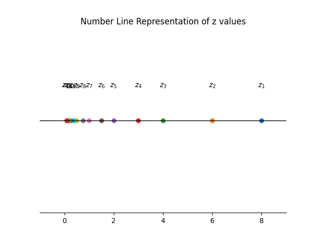
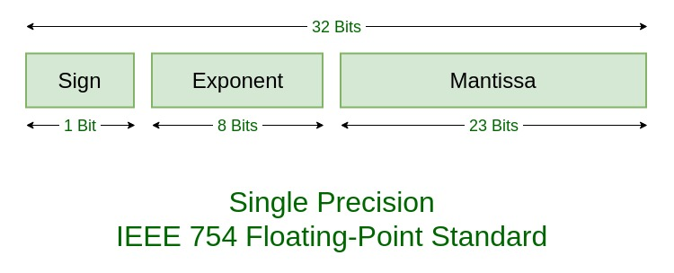
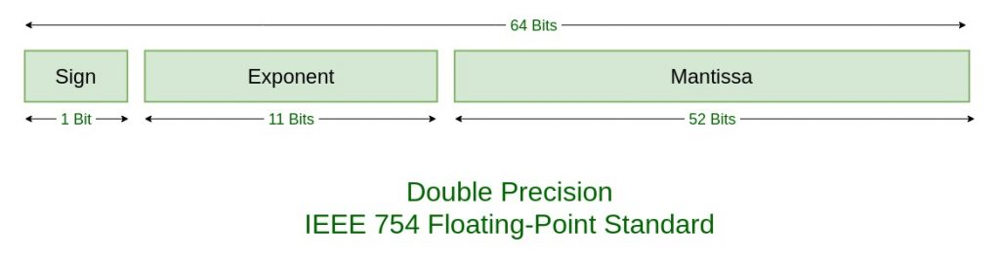

# AMATH242/CS371: Introduction to Computational Mathematics

## Chapter 1: Floating Point Systems
- Numarical algorithms and computers operate on <u>finite percision arithmetic</u>.
- We do not have the totality of $\mathbb{R}$. In fact, we only have a "tiny" portion of $\mathbb{R}$.

> Definition 1.1: Let $\hat{x}$ be an approximation of a real number $x$.
> - Absolute error: $\Delta x = x - \hat{x}$
> - Relative error: $\delta x = \frac{x - \hat{x}}{x}$

### §1.1 Floating Point System
#### §1.1.1 Intro
> Definition 1.2: A floating point system $F \subseteq \mathbb{R}$ is a subset of the real numbers whose elements have the form $z = \pm (0.x_1x_2\dots x_m)_b \times b^{\pm(y_1y_2\dots y_e)_b}$, where $b$ is the base of the system, $x_1x_2\dots x_m$ is the mantissa, and $y_1y_2\dots y_e$ is the exponent
> which is categorized by:
> - Base $b_f$
> - Mantissa $m_f$
> - Exponent $e_f$
> noted as $F[b = b_f, m = m_f, e = e_f]$
> and $0 \leq x_i < b-1$, $0 \leq y_i < b-1$, and $1 \leq i \leq m$ and $1 \leq j \leq e$.

> Example 1.1: $F[b = 10, m = 3, e = 2]$
> - $z = \pm (0.x_1x_2x_3) \times 10^{\pm(y_1y_2)}$
> An example: $z = 0.127 \times 10^{19}$, in which $x_1 = 1, x_2 = 2, x_3 = 7, y_1 = 1, y_2 = 9$.

> Definition 1.3 (Normalization): A floating point number $z \in F \subseteq \mathbb{R}$ $\left(z = \pm (0.x_1x_2\dots x_m)_b \times b^{\pm(y_1y_2\dots y_e)_b}\right)$ is normalized if $x_1 \geq 1$.

> Example 1.1 (cont'd): $F[b = 10, m = 3, e = 2]$
> - $z_1 = 0.127 \times 10^{19}$ is normalized.
> - $z_2 = 0.034 \times 10^{-5}$ is not normalized, but can be normalized to $0.340 \times 10^{-6}$.

___
<u>Intermission</u>: (Converting binary to decimal)

$$\begin{align*}&(a_n a_{n-1} \dots a_1 a_0.a_{-1} a_{-2} \dots a_{-m})_2\\=& a_n \times 2^n + \dots + a_1 \times 2^1 + a_0 \times 2^0 + a_{-1} \times 2^{-1} + \dots + a_{-m} \times 2^{-m}\end{align*}$$
> Example:
> - $(101)_2 = 1 \times 2^2 + 0 \times 2^1 + 1 \times 2^0 = 5$.
> - $(1.11)_2 = 1 \times 2^0 + 1 \times 2^{-1} + 1 \times 2^{-2} = 1.75$.

We can further generalize this:

$$\begin{align*}&(a_n a_{n-1} \dots a_1 a_0.a_{-1} a_{-2} \dots a_{-m})_b\\=& a_n \times b^n + \dots + a_1 \times b^1 + a_0 \times b^0 + a_{-1} \times b^{-1} + \dots + a_{-m} \times b^{-m}\end{align*}$$
___

> Example 1.2: $F[b = 2, m = 2, e = 2]$
> Let's consider all normalized positive numbers in $F$.
> - $z = (0.x_1x_2)_2 \times 2^{\pm(y_1y_2)_2}$
> - $z_1 = (0.11)_2 \times 2^{(11)_2} = 0.75 \times 2^3 = 6$
> - $z_2 = (0.10)_2 \times 2^{(11)_2} = 0.5 \times 2^3 = 4$
> - $z_3 = (0.11)_2 \times 2^{(10)_2} = 0.75 \times 2^2 = 3$
> - $z_4 = (0.10)_2 \times 2^{(10)_2} = 0.5 \times 2^2 = 2$
> - $z_5 = (0.11)_2 \times 2^{(01)_2} = 0.75 \times 2^1 = 1.5$
> - $z_6 = (0.10)_2 \times 2^{(01)_2} = 0.5 \times 2^1 = 1$
> - $z_7 = (0.11)_2 \times 2^{(00)_2} = 0.75 \times 2^0 = 0.75$
> - $z_8 = (0.10)_2 \times 2^{(00)_2} = 0.5 \times 2^0 = 0.5$
> - $z_9 = (0.11)_2 \times 2^{(-01)_2} = 0.75 \times 2^{-1} = 0.375$
> - $z_{10} = (0.10)_2 \times 2^{(-01)_2} = 0.5 \times 2^{-1} = 0.25$
> - $z_{11} = (0.11)_2 \times 2^{(-10)_2} = 0.75 \times 2^{-2} = 0.1875$
> - $z_{12} = (0.10)_2 \times 2^{(-10)_2} = 0.5 \times 2^{-2} = 0.125$
> - $z_{13} = (0.11)_2 \times 2^{(-11)_2} = 0.75 \times 2^{-3} = 0.09375$
> - $z_{14} = (0.10)_2 \times 2^{(-11)_2} = 0.5 \times 2^{-3} = 0.0625$
> 
> 

Observations:
1. Floating point numbers are not eqally spaced. The spacing "jumps" by a factor of 2 at each power of 2.
2. There is an awkward gap between 0 and the smallest normalized number.
3. 0 is unrepresentable in this system.

> Definition 1.4: The distant from 1 to the next larger normalized floating point number is called the machine epsilon, denoted as $\epsilon_{mach}$.
> We have the following,
> - $1 = (0.10\dots00)_b \times b^{(0\dots01)_b}$
> - $\text{next} = (0.10\dots01)_b \times b^{(0\dots01)_b}$
> - $\epsilon_{mach} = (0.00\dots01)_b \times b^{(0\dots01)_b} = b^{1-m}$
>
> Therefore we also found following properties:
> - number $m$ (# of digits in mantissa) is called <u>precision</u>.
> - $\epsilon_{mach}$ is also called <u>machine precision</u>.
> - $\epsilon_{mach} = b^{1-m}$.
> - IMPORTANT: the formula $\epsilon_{mach} = b^{1-m}$ is subject to slight change in single and double precision formats.

> Definition 1.5: The system $F$ can be extended by including <b>subnormal numbers</b> which are implemented by: $\pm (0.0x_2x_3\cdots x_m)_b \times b^{-(b-1,b-1,\cdots,b-1)_b}$, where $0 \leq x_2, x_3,\cdots,x_m \leq b-1$ and $(0.0x_2x_3\cdots x_m)_b \neq 0$.
> * Recall: Closest to zero normalized number: $\pm (0.10\cdots0)_b \times b^{-(b-1,b-1,\cdots,b-1)_b}$.

> Example 1.2 (cont'd): $F[b = 2, m = 2, e = 2]$
> $\pm (0.01)_2 \times 2^{-(11)_2} = \pm 0.03125$ is the only subnormal number in this system.
> 

* If we denote the smallest normalized positive number as $\lambda$, the subnormal numbers fill the gap between 0 and $\lambda$ with the same spacing between $\lambda$ and $b\lambda$.
* Let's see another exmaple: $F[b = 2, m = 3, e = 2]$
 


#### §1.1.2 Rounding, overflow, and underflow
> Definition 1.6: Let $G \subseteq \mathbb{R}$ denote all real numbers that have the form $z = \pm (0.x_1x_2\dots x_m)_b \times b^y, y\in Z$, i.e., we life the lower and upper limits for the exponent.
> For $\forall x \in \mathbb{R}$, then $fl(x)$ denotes the nearest number to $x$ in $G$ and the operation $x \mapsto fl(x)$ is called <u>rounding</u>.

> Example 1.2 (cont'd): $F[b = 2, m = 2, e = 2]$
> 
> Here, $z_1 = 8 \in G \not\in F$.
> $x_1 = 2.8 \rightarrow fl(x_1) = 3$
> $x_2 = 4.5 \rightarrow fl(x_2) = 4$
> $x_3 = 1.25 \rightarrow$ Tie!
> * Two common tie breakers:
>   1. round away from zero: $x_3 = 1.25 \rightarrow fl(x_3) = (0.11)_2 \times 2^{(01)_2} = 1.5$
>   2. round to the one with an even last digit: $x_3 = 1.25 \rightarrow fl(x_3) = (0.10)_2 \times 2^{(01)_2} = 1$
>
> $x_4 = 7.7 \rightarrow fl(x_4) = 8 \not\in F$

> Definition 1.7: We say $fl(x)$ overflows if $|fl(x)| > \max \{|z|: z \in F\}$, and underflows if $0 < |fl(x)| < \min \{|z|: z \in F\}$.

> Example 1.2 (cont'd): $F[b = 2, m = 2, e = 2]$
> $x_5 = 6.1 \rightarrow fl(x_5) = 6$.
> Thus, the following statement is false:
> "Overflow occurs when $x$ is bigger than the biggest normalized number in $F$."

> Theorem 1.1 (Unit roundoff): Each real number $x$ such that $fl(x)$ is a normalized number in $F$ has a relative error no larger than $u = \frac{1}{2}\epsilon_{mach}$, which is called unit roundoff.
> If $x\in \mathbb{R}$ such that $fl(x)$ is normalized in $F$, then $|\delta| = \left|\frac{x - fl(x)}{x}\right| \leq u = \frac{1}{2}\epsilon_{mach}$.
> * subnormal numbe correspond to bigger relative error.

#### §1.1.3 Standard floating point systems

- Single precision format (32-bit)
  
    - Sign bit: $s=1$ for negative, $s=0$ for positive.
    - Exponent:
        - We have $2^8 = 256$ exponents, therefore face value $[0,255]$.
        - We want a range of signed exponents. The convention is face value subtracted by a bias of 127 $\rightarrow [-127,128]$.
        - When $e = \begin{cases} (00000000)_2 \rightarrow -127 \\ (11111111)_2 \rightarrow 128 \end{cases}$ reserved for subnormals and special numbers.
        - |exponent | mantissa (all zero) | mantissa (not all zero)|
          |-----|-----|-----|
          | $(00\cdots 00)_2$ |  $\pm 0$ | subnormals |
          | $(11\cdots 11)_2$ | $\pm \infty$ | NaN (Not a number) |
        - When $e \in [-126,127]$, we have normalized numbers.
    - Mantissa:
        Consider this model we have previously: $(0.x_1x_2\cdots x_{23})_2$
        - $x_1 \equiv 1$, since:
          1. $x_1 \geq 1$ (normalized numbers)
          2. $x_1 \leq 1$ ($b-1=2-1=1$)

        Therefore, convension is: $(1.x_1x_2\cdots x_{23})_2$.

  - A general formula for normalized numbers:
    $x_0 | x_1x_2\cdots x_{22}x_{23} | y_1y_2\cdots y_8$
    $\implies (-1)^{x_0}  \times (1.x_1x_2\cdots x_{23})\times 2^{(y_1y_2\cdots y_8)_2 - 127}$

  > Example 1.3: (Important quantities in single precision format)
  > 1. Biggest positive normalized number: 
  >    $0|\overbrace{1\cdots1}^{23 \text{ one's}}|\overbrace{01111111}^{8 \text{ bits}}$
  >    $= (-1)^0 \times (1.\overbrace{111\cdots1}^{23 \text{ one's}})_2 \times 2^{(11111110)_2-127}$
  >    $= (1\times 2^0 + 1\times 2^{-1} + 1\times 2^{-2} + \cdots + 1\times 2^{-23}) \times 2^{127}$
  >    $= ((2^{-1})^0 + (2^{-1})^1 + (2^{-1})^2 + \cdots + (2^{-1})^{23}) \times 2^{127}$
  >    $= (2^{-1})^0 \frac{1 - (2^{-1})^{24}}{1 - 2^{-1}} \times 2^{127}$
  >    $= (2 - 2^{-23}) \times 2^{127} = 2^{128} - 2^{104}$
  >    $\approx 3.402823 \times 10^{38}$
  > 2. Smallest positive normalized number:
  >    $0|\overbrace{0\cdots0}^{23 \text{ zero's}}|\overbrace{00000001}^{8 \text{ bits}}$
  >    $= (-1)^0 \times (1.\overbrace{000\cdots0}^{23 \text{ zero's}})_2 \times 2^{(00000000)_2-127}$
  >    $= 1 \times 2^{-126} = 2^{-126}$
  >    $\approx 1.175494 \times 10^{-38}$
  > 3. Machine epsilon:
  >    Firstly: One: 
  >    $(-1)^0 \times (1.00\cdots0)_2 \times 2^0$
  >    $=(-1)^0 \times (1.00\cdots0)_2 \times 2^{(01111111)_2-127}$
  >    $\implies 0|00\cdots00|01111111$
  >    Next larger number:
  >    $0|00\cdots01|01111111$
  >    $=(-1)^0 \times (1.00\cdots01)_2 \times 2^0$
  >    $=1 \times 2^0 + 2^{-23} = 1 + 2^{-23}$
  >    Therefore, $\epsilon_{mach} = 2^{-23} \approx 1.1920929 \times 10^{-7}$.

  |Quantity | Value |
  |-----|-----|
  |biggest positive normalized number | $2 ^{128} - 2^{104} \approx 3.402823 \times 10^{38}$ |
  |smallest positive normalized number | $2^{-126} \approx 1.175494 \times 10^{-38}$ |
  |machine epsilon | $2^{-23} \approx 1.1920929 \times 10^{-7}$ |

  > IMPORTANT: The formula $\epsilon_{mach} = b^{1-m}$, hence $b = 2$ and $m = 23 \implies \epsilon_{mach} = 2^{1-23} = 2^{-22} \neq 2^{-23}$. This is due to that the assumed leading 1 in the mantissa, despite not being stored, is countributing to a significant bit.
  > If we want to use $b^{1-m}$, we need to plug in $m = 24$.

  > Example 1.3 (cont'd):
  > 4.  Overflow:
    Biggest positive normalized number: $0|\overbrace{1\cdots1}^{23 \text{ one's}}|01111111$
    $\implies (-1)^0 \times (1.111\cdots1)_2 \times 2^{(11111110)_2 - 127}$
    $ = (1.111\cdots1)_2 \times 2^{127}$
    Second biggest positive normalized number: $0|\overbrace{11\cdots10}^{23 \text{ bits}}|01111111$
    $\implies (-1)^0 \times (1.11\cdots10)_2 \times 2^{127}$
    $ = 2^{128} - 2^{104} - 2^{104}$

    If no limit on the exponent, the next largest number would be $2^{128}$.
    Number lying in between $(2^{128} - 2^{104} , 2^{128})$ should still be rounded to $2^{128} - 2^{104}$ (hence not causing overflow) if it is closer to $2^{128} - 2^{104}$.

- Double precision format (64-bit)
  
    - It is MATLAB's default format.
    - `eps = eps('double')` $\approx 2.2204 \times 10^{-16}$.
      $10^{-16}$ is a magic number , when we have an error of $\mathcal{O}(10^{-16})$, we should be happy.

#### §1.1.4 Floating point operations
> Definition 1.8: Floating point addition $\oplus$ is defined by:
> $\forall x, y \in \mathbb{R}$, $fl(x \oplus y) = fl(fl(x) + fl(y))$. Similarly define $\ominus, \otimes, \oslash$.

1. $x \oplus y \oplus z$
  $ = (x \oplus y) \oplus z$
  $ = fl(fl(x) + fl(y)) \oplus z$
  $ = fl(fl(fl(x) + fl(y)) + fl(z))$
2. $x \oplus y \otimes z$
  $ = x \oplus (y \otimes z)$
  $ = fl(x) \oplus fl(fl(y) \otimes fl(z))$
  $ = fl(fl(x) + fl(fl(y) \times fl(z)))$
3. $(\cos(x))^2$
  $ = fl(\cos(fl(x)) \otimes \cos(fl(x)))$
  $ = fl(fl(\cos(fl(x)))^2)$

> Question: Is floating point addition associative, i.e., $x \oplus y \oplus z = x \oplus (y \oplus z)$?
> Try in MATLAB: 
> `(1 + eps / 3) + eps / 3 == 1 + (eps / 3 + eps / 3)`
> Answer: False. `(1 + eps / 3) + eps / 3` would return `1`, while `1 + (eps / 3 + eps / 3)` would return `1 + eps`.

This problem is significant, see the following example:
```matlab
while x <= pi
    ...
end
```
If `x` is very close to `pi`, the loop may iterate one more time or one less time than expected, due to the accumulation of errors.

A better way to write the loop is:
```matlab
while abs(x - pi) > eps(x)
    ...
end
```
This way, the loop will iterate until `x` is within the machine epsilon of `pi`.

#### §1.1.5 Cancelation Error
- The phenomenon that subtracting two good approximations (say $\hat{x}$ and $\hat{y}$) of two nearby numbers (say $x$ and $y$) may yield a very bad approximation to $x-y$ ($\hat{x} - \hat{y} \not\approx x - y$).

> Example 1.4: (Subtraction between close numbers)
> We use a decimal floating point system $F[b = 10, m = 5, e = 3]$.
> $x = 0.100134826 \implies fl(x) = 0.10013$
> $y = 0.100121111 \implies fl(y) = 0.10012$
> $\delta x = \frac{x - fl(x)}{x} = 0.0048\%$
> $\delta y = \frac{y - fl(y)}{y} = 0.0011\%$
> $z = x - y = 0.000013715$
> $\hat{z} = fl(x) - fl(y) = fl(0.10013-0.10012) = 0.00001$
> $\delta z = \frac{z - \hat{z}}{z} = 27\%$

> Example 1.5: (Evaluation of the exponential function)
> - Exact: $z = \text{exp}(x) = e^x$
> - Approximation: $\hat{z} = \text{some\_algorithm}(x)$
>> Algorithm A: Truncation of the Taylor series
>> - $z = \text{exp}(x) = \sum_{i=0}^{\infty} \frac{x^i}{i!} = 1 + x + \frac{x^2}{2} + \frac{x^3}{6} + \cdots + \frac{x^n}{n!} + \cdots$
>> - $\hat{z} = \sum_{i=0}^{n} \frac{x^i}{i!} = 1 + x + \frac{x^2}{2} + \frac{x^3}{6} + \cdots + \frac{x^n}{n!}$
>> This is not a good algorithm!
>> An example (with $F[b = 10, m = 5, e = 3]$): 
>> Let $x = -5.5 \implies z = e^{-5.5} \approx 0.0040868$.
>> Let $n = 24 \implies \hat{z}_A = \sum_{i=0}^{24} \frac{(-5.5)^i}{i!} \overset{\text{in }F}{\implies} 0.0051563$.
>> Relative error: $\delta z_A = \frac{z - \hat{z}}{z} \approx -41\%$.
>
>> Algorithm B: 
>> For $x > 0$, $\hat{z}_B = \hat{z}_A$.
>> For $x < 0$, we use $\text{exp}(x) = \text{exp}(-x)^{-1}$.
>> $\hat{z}_B = \left(\sum_{i=0}^{n} \frac{(-x)^i}{i!}\right)^{-1}$
>> Test on the same example: $x = -5.5 \implies z = e^{-5.5} \approx 0.0040868$.
>> Let $n = 24 \implies \hat{z}_B = \left(\sum_{i=0}^{24} \frac{5.5^i}{i!}\right)^{-1} \overset{\text{in }F}{\implies} 0.0040865$.
>> Relative error: $\delta z_B = \frac{z - \hat{z}}{z} \approx 0.00734\%$.

### §1.2 Conditioning of a math problem
- Consider a problem $P$ with input $\vec{x}$ and output $\vec{y} = f_P(\vec{x})$.
- No algorithm or floating point system involved yet!

> Definition 1.9: (Conditioning of $P$)
> - $P$ is <b>well-conditioned</b> with respect to the absolute error if small change in $\Delta \vec{x}$ in $\vec{x}$ result in small change in $\Delta \vec{z}$ in $\vec{z}$.
> - $P$ is <b>ill-conditioned</b> with respect to the absolute error if small change in $\Delta \vec{x}$ in $\vec{x}$ result in large change in $\Delta \vec{z}$ in $\vec{z}$.
> - Similarly, we can define both with respect to the relative error.

---
Intermission: (Vector norms)
Let $\vec{x} = (x_1, x_2, \cdots, x_n) \in \mathbb{R}^n$.
- 2-norm: $\|\vec{x}\|_2 = \sqrt{x_1^2 + x_2^2 + \cdots + x_n^2}$.
- 1-norm: $\|\vec{x}\|_1 = |x_1| + |x_2| + \cdots + |x_n|$.
- $\infty$-norm: $\|\vec{x}\|_{\infty} = \max\{|x_1|, |x_2|, \cdots, |x_n|\}$.
- p-norm: $\|\vec{x}\|_p = \left(\sum_{i=1}^{n} |x_i|^p\right)^{1/p}$ (for $p \geq 1$).
___

> Definition 1.10: (Condition number of $P$)
> - The absolute condition number of $P$: $\kappa_{A} = \frac{\|\Delta \vec{z}\|}{\|\vec{x}\|}$.
> - The relative condition number of $P$: $\kappa_{R} = \frac{\|\Delta \vec{z}\|/\|\vec{z}\|}{\|\Delta \vec{x}\|/\|\vec{x}\|}$.

> Example 1.6: $P: z = x + y$
> Let $\hat{x} = x - \Delta x$, $\hat{y} = y - \Delta y$, and $\hat{z} = \hat{x} + \hat{y}$.
> Then $\Delta z = z - \hat{z} = (x + y) - (x - \Delta x + y - \Delta y) = \Delta x + \Delta y$.
> 1. With 1-norm: $\kappa_{A} = \frac{|\Delta z|}{\|(\Delta x, \Delta y)\|_1} = \frac{|\Delta x + \Delta y|}{|\Delta x| + |\Delta y|} \overset{\text{triangle ineq.}}{\leq} 1$.
> 2. With 1-norm: $\kappa_{R} = \frac{|\Delta z|/|z|}{\|(\Delta x, \Delta y)\|_1/\|(\vec{x}, \vec{y})\|_1} = \frac{|\Delta x + \Delta y|/|x + y|}{(|\Delta x| + |\Delta y|)/(|x| + |y|)} =  \frac{|\Delta x + \Delta y|}{|\Delta x| + |\Delta y|} \cdot \frac{|x| + |y|}{|x + y|}\leq 1\cdot \frac{|x| + |y|}{|x + y|}$.
> If $x \to -y$, then $\kappa_{R} < \infty \implies \kappa_{R} \to \infty$.
> 
> Therefore, $P$ is well-conditioned with respect to the absolute error, but ill-conditioned with respect to the relative error.

### §1.3 Stability of an algorithm

- If $P$ is well-conditioned, numerical algorithms for $P$ can still be unstable.

> Example 1.5 (revisiting):
> $P: z = \text{exp}(x)$.
> To estimate its condition number:
> Let $\hat{x} = x - \Delta x$ and $\hat{z} = \text{exp}(\hat{x}) = \text{exp}(x) - \text{exp}(x)\Delta x + \mathcal{O}(\Delta x^2)$.
> 1. absolute condition number: $\kappa_{A} = \frac{|\Delta z|}{|\Delta x|} = \frac{|z - \hat{z}|}{\Delta x} = \frac{|\text{exp}(x) \Delta x - \mathcal{O}(\Delta x^2)|}{\Delta x} \leq |\text{exp}(x)| + \mathcal{O}(\Delta x) \approx \text{exp}(x)$.
> $P$ is well-conditioned with respect to the absolute error except for large $|x|$.
> 2. relative condition number: $\kappa_{R} = \frac{|\Delta z|/|z|}{|\Delta x|/|x|} = \frac{|\Delta z|}{|\Delta x|} \cdot \frac{|x|}{|z|} \approx |\text{exp}(x)| \cdot \frac{|x|}{|\text{exp}(x)|} = |x|$.
> $P$ is well-conditioned with respect to the relative error except for large $|x|$.

- Recall algorithm A and B for $P: \text{exp}(x)$.
  - For $x < 0$, algorithm A is unstable even if $|x|$ is small while algorithm B is stable.
  - "recipe" for "numerical success":
    well-conditioned problem + stable algorithm

---
Intermission: (Taylor series of a function $f(x)$ about a point $x = a$)
- $f(x) = f(a) + f'(a)(x-a) + \frac{f''(a)}{2!}(x-a)^2 + \cdots + \frac{f^{(n)}(a)}{n!}(x-a)^n + \cdots = \sum_{n=0}^{\infty} \frac{f^{(n)}(a)}{n!}(x-a)^n$.
- Big $\mathcal{O}$ notation: $f(x) = f(a) + + f'(a)(x-a) + \cdots + \frac{f^{(n)}(a)}{n!}(x-a)^n + \mathcal{O}((x-a)^{n+1})$.
What we use a lot: $f(x) = f(a) + f'(a)(x-a) + \mathcal{O}((x-a)^2)\ \  \star$. 
> Example 1: $f(x) = \text{exp}(x) \implies f'(x) = \text{exp}(x)$.
> - $f(x) = \text{exp}(a) + \text{exp}(a)(x-a) + \mathcal{O}((x-a)^2)$.
> Consider the problem of evaluating $z = \text{exp}(x)$.
> Let $\hat{x} = x - \Delta x$, then $\hat{z} = \text{exp}(\hat{x}) = \text{exp}(x - \Delta x) = \text{exp}(x) + \text{exp}(x)((x - \Delta x) - x) + \mathcal{O}((x - \Delta x - x)^2) = \text{exp}(x) + \text{exp}(x)(- \Delta x) + \mathcal{O}((\Delta x)^2)$.
> Thus, $\kappa_{A} = \frac{|z - \hat{z}|}{|x - \hat{x}|} = \frac{|\text{exp}(x) - ({exp}(x) + \text{exp}(x)(- \Delta x) + \mathcal{O}((\Delta x)^2))|}{|\Delta x|}  = |\text{exp}(x) + \mathcal{O}(\Delta x)| \leq \text{exp}(x) + \mathcal{O}(\Delta x) \approx \text{exp}(x)$.
___