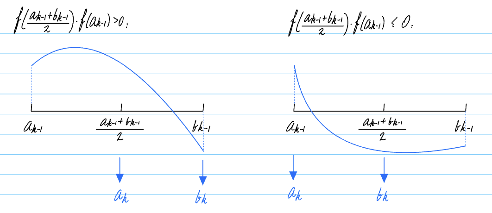
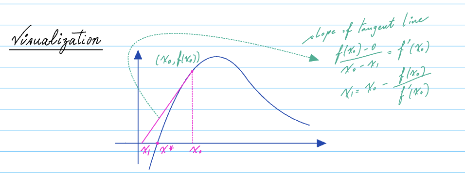
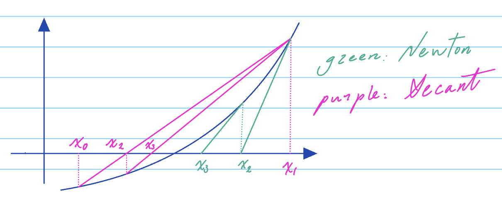
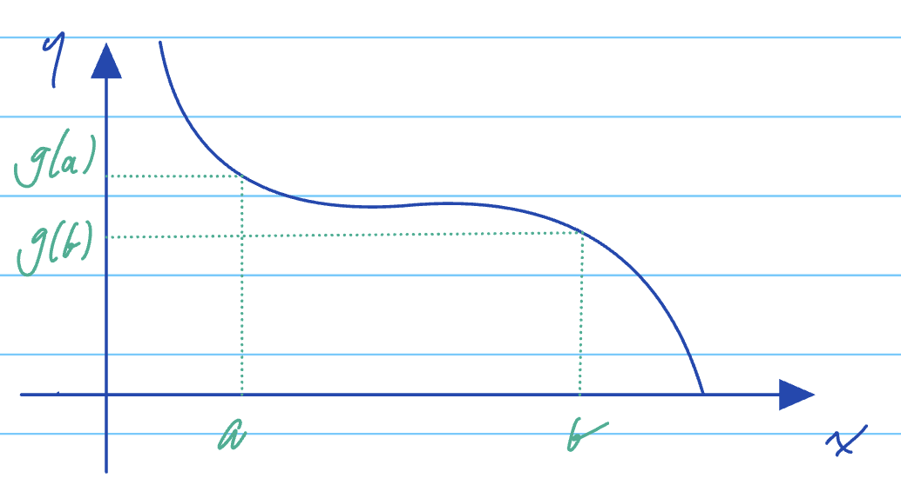
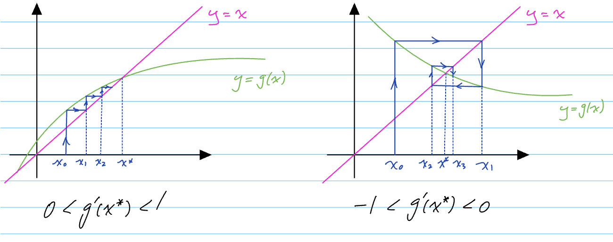
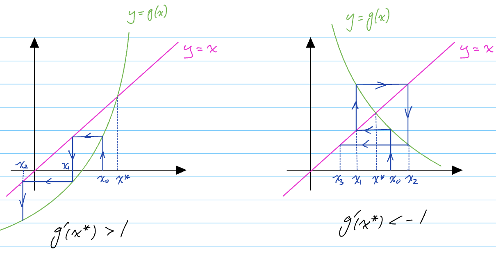
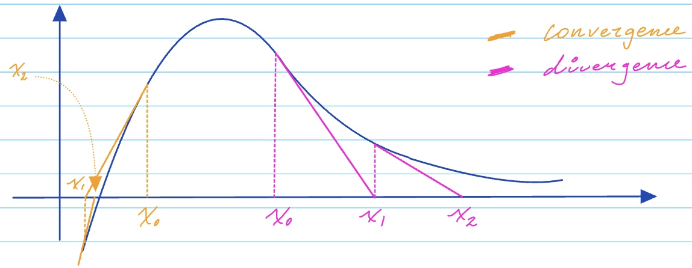

## Chapter 2: Root finding algorithms
### §2.1 Introduction
> <u>Problem</u>: Given any function $f(x)$, find $x^*$ such that $f(x^*) = 0$. Then $x^*$ is called a root of $f(x)=0$.
> - Computationally, we can only aim for finding $x^*$ such that $|f(x^*)| < \tau$ for some error tolerance $\tau$.
> - There is no method that guarantees finding the root(s) of any function.

> Theorem 2.1: (Intermediate Value Theorem)
> If $f(x)$ is continuous on a closed interval $[a, b]$ and $c \in [f(a), f(b)]$, then there exists $x^* \in [a, b]$ such that $f(x^*) = c$.

> Corollary 2.2: If $f(a)f(b) < 0$ for a closed interval $[a, b]$, then there exists at least one root $x^*$ as long as $f(x)$ is continuous$.

### §2.2 Four algorithms for root finding
#### §2.2.1 Bisection method
> Theorem 2.3: If $f(x)$ is continuous on $[a_0, b_0]$ such that $f(a_0)f(b_0) \leq 0$, then $[a_k, b_k]$, defined by $[a_k, b_k] := \begin{cases} [a_{k-1}, \frac{a_{k-1}+b_{k-1}}{2}] & \text{if } f(a_{k-1})f(\frac{a_{k-1}+b_{k-1}}{2}) \leq 0 \\ [\frac{a_{k-1}+b_{k-1}}{2}, b_{k-1}] & \text{if } f(a_{k-1})f(\frac{a_{k-1}+b_{k-1}}{2}) > 0 \end{cases}$ holds that $f(a_k)f(b_k) \leq 0$ for any $k \geq 1$.


> Algorithm 2.1: Bisection algorithm
> ```python
> # Input: f(x), a, b, tolerance tau.
> # Output: x, an approximant of x^* (f(x^*) = 0).
> while |b-a| > tau: # alternatively, |f((a+b)/x)| > tau
>     c = (a+b)/2
>     if f(a)*f(c) <= 0:
>         b = c
>     else:
>         a = c
>     end if
> end while
> x = (a+b)/2
> ```

#### §2.2.2 Fixed-point iteration
> Definition 2.1: We say that $x^*$ is a fixed point of $g(x)$ if $g(x^*) = x^*$.

> <u>Problem</u>: Root finding of f(x) is equivalent to finding the fixed point of $g(x) = x - f(x)$.
> $f(x^*) = 0 \Leftrightarrow x^* - f(x^*) = x^* \Leftrightarrow g(x^*) = x^*$.

- The fixed point interation: $x_{n+1} = g(x_n), n = 0, 1, 2, \cdots$.

> Algorithm 2.2: Fixed-point iteration
> ```python
> # Input: g(x), x_0, tolerance tau.
> # Output: x, an approximant of x^* (f(x^*) = 0).
> i = 0
> repeat
>    i = i + 1
>    x[i] = g(x[i-1])
> until |x[i] - x[i-1]| < tau
> x = x[i]
> ```

Convergence? If $|g'(x)| < 1$ and $x_0$ is close enough to $x^*$, then algorithm 2.2 will converge to $x^*$. More on this in §2.4.

#### §2.2.3 Newton's method
Consider the Taylor series of $f(x^*)$ about an initial estimate $x_0$:
$$\begin{aligned} 0 = f(x^*) &= f(x_0) + f'(x_0)(x^*-x_0) + \mathcal{O}((x^*-x_0)^2) \\ f(x^*) &\approx f(x_0) + f'(x_0)(x^*-x_0) \\ 0 &= f(x_0) + f'(x_0)(x_1-x_0) \\ x_1 &= x_0 - \frac{f(x_0)}{f'(x_0)} \end{aligned}$$

Thus we have iteration:
$ 0 = f(x_k) \approx f(x_{k-1}) + f'(x_{k-1})(x_k-x_{k-1}) \Rightarrow x_k = x_{k-1} - \frac{f(x_{k-1})}{f'(x_{k-1})}$.

> Algorithm 2.3: Newton's method
> ```python
> # Input: f(x), f'(x), x_0, tolerance tau.
> # Output: x, an approximant of x^* (f(x^*) = 0).
> i = 0
> x[0] = x_0
> repeat
>    i = i + 1
>    if f'(x[i-1]) == 0 stop
>    x[i] = x[i-1] - f(x[i-1])/f'(x[i-1])
> until |x[i] - x[i-1]| < tau # or |f(x[i])| < tau
> x = x[i]
> ```
Convergence? Under some conditions on $f(x)$, $f'(x)$ and that $x_0$ is close enough to $x^*$, Newton's method converges and converges "quadratically"! More on this in §2.4.

#### §2.2.4 Secant method
A modification of Newton's method such that knowledge of $f'(x)$ is not needed.
Newton's method: $x_k = x_{k-1} - \frac{f(x_{k-1})}{f'(x_{k-1})}$.
Given $f'(x_{k}) \approx \frac{f(x_{k})-f(x_{k-1})}{x_{k}-x_{k-1}}$, we have the secant method:
$x_k = x_{k-1} - f(x_{k-1})\frac{x_{k-1}-x_{k-2}}{f(x_{k-1})-f(x_{k-2})}$.

- We need two initial values to kick off the iteration.
- We need to be careful with the case $f(x_k) \approx f(x_{k-1})$. Same as the case $f'(x_k) \approx 0$ in Newton's method.

Visualization of the secant method:


> Algorithm 2.4: Secant method
> ```python
> # Input: f(x), x_0, x_1, tolerance tau.
> # Output: x, an approximant of x^* (f(x^*) = 0).
> i = 1
> x[0] = x_0, x[1] = x_1
> repeat
>    i = i + 1
>    if f(x[i-1]) == f(x[i-2]) stop
>    x[i] = x[i-1] - f(x[i-1])*(x[i-1]-x[i-2])/(f(x[i-1])-f(x[i-2]))
> until |x[i] - x[i-1]| < tau # or |f(x[i])| < tau
> x = x[i]

#### §2.2.5 Stopping criteria of iterative methods

Three common ones:
1. Maximum number of stops
2. Tolerance on the size of the correction: $|x_{k+1} - x_k| < \tau$. If $|f'(x^*))| \gg 1$, small error in $x$ could mean a large value of $f(x)$.
3. Tolerance on the size of the funcation value: $|f(x_k)| < \tau$. If $f'(x^*) \ll 1$, for $x_k$ far from $x^*$, $|f(x_k)|$ could be small.

### §2.3 Intro of convergence of iterative methods

> Definition 2.2: For a sequence $\{x_i\}_{i=0}^\infty$ and point $x^*$, the error at iteration $i$ is $e_i := x_i - x^*$.

> Definition 2.3: The sequence $\{x_i\}_{i=0}^\infty$ converges to $x^*$ with order of convergence $q$ if and only if:
> 1. $\{x_i\}_{i=0}^\infty$ converges to $x^*$.
> 2. $|e_{i+1}| = C_i|e_i|^q$ where $\lim_{i\to\infty} C_i = C^*$ for some constant $C^* \in (0,\infty)$.
> 3. When $q=1$, we call the convergence linear and we further require $C^* < 1$, which is also called rate of convergence.

Sometimes we can show easily $|e_i| \leq \alpha(C^*)^i$ for some $\alpha > 0$ and some $C^* \in (0, 1)$, we say that also characterizes a linear convergence with a rate of convergence $C^*$.

| Method | Guaranteed convergence | Order of convergence | Knowleadge of $f'(x)$ |
| --- | --- | --- | --- |
| Bisection Method | Yes | Linear (q=1) | No |
| Fixed-point iteration | Depending on $g(x)$ and $x_0$ | Linear (q=1) | No |
| Newton's method | Depending on $f(x)$ and $x_0$ | Quadratic (q=2) | Yes |
| Secant method | Depending on $f(x)$ and $x_0, x_1$ | $ 1 < q = \frac{1+\sqrt{5}}{2} < 2$ | No |

### §2.4 Convergence of root finding algorithms

#### §2.4.1 Bisection method

Consider the sequence $\{L_i\}_{i=0}^\infty$ with $L_i = |b_i - a_i|$ and $x_i = \frac{a_i+b_i}{2}$.
- $L_{i+1} = \frac{L_i}{2}$.
- $|l_n| \leq L_n \leq \left(\frac{1}{2}\right)^n L_0 = \left(\frac{1}{2}\right)^n (b_0-a_0)$.
We say that the biseciton method converges linearly with a rate of convergence $C^* = \frac{1}{2}$.

#### §2.4.2 Fixed-point iteration

> Definition 2.4: Suppose $g(x)$ is continuous on $[a, b]$. Then $g(x)$ is said to be a contraction on $[a, b]$ if there exists a constant $L \in (0, 1)$ such that $|g(x) - g(y)| \leq L|x-y|$ for all $x, y \in [a, b]$.

Visualization:

Note $|g(b) - g(a)| \leq |b-a|$.

> Proportion 2.1: If $g(x)$ is differentiable on $[a, b]$ with $|g'(x)| < 1$ for all $x \in [a, b]$, then $g(x)$ is a contraction on $[a, b]$ with $L = \max_{x\in[a, b]}|g'(x)|$.
>> Proof:
> Mean Value Theorem says: If $g(x)$ is differentiable on $[a, b]$, then there exists $c \in (a, b)$ such that the tangent line at $c$ is parallel to the secant line connecting $(a, g(a)$ and $(b, g(b))$, i.e., $g'(c) = \frac{g(b)-g(a)}{b-a}$. To see if $g(x)$ is a contraction, for any $x, y \in [a, b]$, we have $\frac{g(x)-g(y)}{x-y} = g'(c)$ for some $c \in (x, y)$, thus, $\frac{|g(x)-g(y)|}{|x-y|} = |g'(c)| \leq \max_{x\in[a, b]}|g'(x)| = L$.

> Theorem 2.4 (Contraction Mapping Theorem): Let $g(x)$ be continuous on $[a, b]$ and assume that:
> - $g(x) \in [a, b]$
> - $g(x)$ is a contraction on $[a, b]$.
>
> Then,
> 1. $g(x)$ has a unique fixed point $x^* \in [a, b]$.
> 2. The sequence $\{x_k\}_{k=0}^\infty$ defined by $x_{k+1} = g(x_k)$ converges to $x^*$ as $k \to \infty$ for any starting point $x_0 \in [a, b]$.
>
>> Proof Ommited, see KA Theorem 2.3.

> Corollary 2.5 (Convergence of fixed point iteration):
> Let $g'(x)$ be continuous on $[a, b]$ and assume that:
> - $g(x) \in [a, b]$
> - $|g'(x)| < 1$ for all $x \in [a, b]$.
>
> Then:
> 1. $g(x)$ has a unique fixed point $x^* \in [a, b]$.
> 2. The sequence $\{x_k\}_{k=0}^\infty$ defined by $x_{k+1} = g(x_k)$ converges to $x^*$ as $k \to \infty$ for any starting point $x_0 \in [a, b]$.
> 3. The sequence $\{x_k\}_{k=0}^\infty$ converges with $|e_{k+1}| = C_k|e_k|$ and $\lim_{k\to\infty} C_k = |g'(x^*)|$.
>
>If $|g'(x^*)| \in (0, 1)$, we have linear convergence; if $|g'(x^*)| = 0$, we have faster convergence.
>
> Consider $g(x) = M$ for some constant $M$. Then:
> 1. $x^* = M$.
> 2. $g'(x^*) = 0$.
> 3. $g''(x^*) = g^{(3)}(x^*) = \cdots = 0$.
> 
> Given $\forall x_0 \implies x_1 = g(x_0) = M$, it means convergence in one step!
> 
> Generally: If $g'(x^*) = g''(x^*) = \cdots = g^{(k)}(x^*) = 0$, the bigger $k$, the faster the convergence.
>> Proof ommited, see KA Theorem 2.6.

> Colloary 2.6 (Divergence of fixed point iteration):
> Let $g(x)$ be continuous on $[a, b]$ and $g(x)$ has a unique fixed point $x^*$ on $[a, b]$. If $|g'(x^*)| > 1$, then the sequence $\{x_k\}_{k=0}^\infty$ defined by $x_{k+1} = g(x_k)$ diverges for any starting point $x_0 \in [a, b]$.
>> Proof ommited, see KA Theorem 2.6.

> Example 2.2: We will illustrate Collaries 2.5 and 2.6:



#### §2.4.3 Newton's method

> Theorem 2.7 (Convergence of Newton's method):
> If $f(x^*) = 0$, $f'(x^*) \neq 0$ and $f(x)$, $f'(x)$, $f''(x)$ are continuous in $I_{\delta} = [x^*-\delta, x^*+\delta]$ for some $\delta > 0$, and if $x_0$ is sufficiently close to $x^*$, then the sequence $\{x_k\}_{k=0}^\infty$ (produced by Newton iteration) converges quadratically to $x^*$ with $|e_{k+1}| = C_k|e_k|^2$ where $\lim_{k\to\infty} C_k = \frac{|f''(x^*)|}{2|f'(x^*)|}$.
>> Proof ommited, see KA Theorem 2.1.

> Example 2.3: If $x_0$ is too far from $x^*$, Newton's method fails to converge:


#### §2.4.4 Secant method

> Theorem 2.8 (Convergence of secant method):
> If $f(x^*) = 0$, $f'(x)\neq 0$ and $f(x)$, $f'(x)$, $f''(x)$ are continuous in $I_{\delta} = [x^*-\delta, x^*+\delta]$ for some $\delta > 0$, and if $x_0$ and $x_1$ are sufficiently close to $x^*$, then the sequence $\{x_k\}_{k=0}^\infty$ (produced by secant iteration) converges to $x^*$ with order of convergence $q = \frac{1+\sqrt{5}}{2}$, $|e_{k+1}| = C_k|e_k|^q$ where $\lim_{k\to\infty} C_k = \frac{f''(x^*)}{2f'(x^*)} ^{\frac{\sqrt{5}-1}{2}}$.
>> Proof ommited, see KA Theorem 2.3.