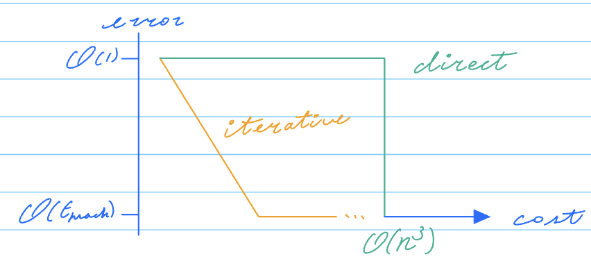

## Chapter 3: Numerical linear algebra
### §3.1 Introduction

<u>Problem</u>: Solve for $\vec{x}$, given the linear system $A\vec{x} = \vec{b}$, with $A \in \mathbb{R}^{n \times n}$, $\vec{x}, \vec{b} \in \mathbb{R}^n$.
$$\begin{pmatrix}a_{11} & a_{12} & \cdots & a_{1n} \\ a_{21} & a_{22} & \cdots & a_{2n}\\\vdots & \vdots & \ddots & \vdots \\ a_{n1} & a_{n2} & \cdots & a_{nn} \end{pmatrix} \begin{pmatrix}x_1\\x_2\\\vdots\\x_n\end{pmatrix}=\begin{pmatrix}b_1\\b_2\\\vdots\\b_n\end{pmatrix}$$

> Definition 3.1: (Determinant)
> The determinant of a  matrix $A \in \mathbb{R}^{n \times n}$ is given by
> $$\det(A) = \sum_{j=1}^n (-1)^{i+j}a_{ij}\det(A_{ij})$$
> - $i$ can be any number from 1 to $n$, then $a_{ij} (j = 1, 2, \ldots, n)$ comes from the $i$-th row of $A$.
> - $A_{ij}$ is the $(n-1) \times (n-1)$ matrix obtained by removing the $i$-th row and $j$-th column from the original matrix $A$.

> Example 3.1: 
> $$\begin{align*}&\det\begin{pmatrix}1 & 2 & 3 \\ 4 & 5 & 6 \\ 7 & 8 & 9\end{pmatrix} \\ =& (-1)^{1+1} a_{11} \det\begin{pmatrix}5 & 6 \\ 8 & 9\end{pmatrix} \\&+ (-1) ^{1+2}a_{12} \det\begin{pmatrix}4 & 6 \\ 7 & 9\end{pmatrix} \\&+ (-1)^{1+3}a_{13} \det\begin{pmatrix}4 & 5 \\ 7 & 8\end{pmatrix} \\ =& (-1)^{1+1} \times 1 \times (5 \times 9 - 6 \times 8) \\&+ (-1)^{1+2} \times 2 \times (4 \times 9 - 6 \times 7) \\&+ (-1)^{1+3} \times 3 \times (4 \times 8 - 5 \times 7) \\ =& 0\end{align*}$$

> Theorem 3.1: (Existance and uniqueness of solution of $A\vec{x} = \vec{b}$)
> - Case 1: If $\det(A) \neq 0$, then $\vec{x} = A^{-1}\vec{b}$ is the unique solution of $A\vec{x} = \vec{b}$.
> - Case 2: If $\det(A) = 0$, then
>    - Case 2a: If $\vec{b} \in \text{range}(A)$, then $A\vec{x} = \vec{b}$ has infinitely many solutions.
>    - Case 2b: If $\vec{b} \notin \text{range}(A)$, then $A\vec{x} = \vec{b}$ has no solution.

### §3.2 Gaussian elimination
#### §3.2.1 LU factorization
> Algorithm 3.1: (Gaussian elimination)
> - Phase 1: Reduce the matrix A to upper triangular form.
> - Phase 2: Solve the reduced system.

> Definition 3.2: A matrix $A \in \mathbb{R}^{n \times n}$ with components $a_{ij}$ is said to be
> - upper triangular if $a_{ij} = 0$ for $i > j$,
> - lower triangular if $a_{ij} = 0$ for $i < j$,
>
> $A \in \mathbb{R}^{n \times n}$ is said to be a triangular matrix if it is either upper or lower triangular.
> Solving these triangular systems are relatively straightforward.

> Algorithm 3.2: (Forward and backward substitution)
> $A\vec{x} = \vec{b}, A \in \mathbb{R}^{n \times n}, \vec{b} \in \mathbb{R}^{n\times 1}$n
> - A: upper triangular $\Rightarrow$ backward substitution)
> 
> $$\begin{align*}x_n &= a_{n,n}^{-1} b_n \\ x_{n-1} &= a_{n-1,n-1}^{-1} (b_{n-1} - a_{n-1,n}x_n) \\ x_{n-2} &= a_{n-2,n-2}^{-1} (b_{n-2} - a_{n-2,n}x_n - a_{n-2,n-1}x_{n-1}) \\ &\vdots \\ x_i &= a_{ii}^{-1} (b_i - \sum_{k=i+1}^n a_{ik}x_k) \end{align*}$$
>
> - A: lower triangular $\Rightarrow$ forward substitution)
> 
> $$\begin{align*}x_1 &= a_{11}^{-1} b_1 \\ x_2 &= a_{22}^{-1} (b_2 - a_{21}x_1) \\ x_3 &= a_{33}^{-1} (b_3 - a_{31}x_1 - a_{32}x_2) \\ &\vdots \\ x_i &= a_{ii}^{-1} (b_i - \sum_{k=1}^{i-1} a_{ik}x_k) \end{align*}$$
> Now we see how a dense matrix $A$ is reduced to an (upper-)triangular form: (with an example first)

> Example 3.2: Consider the system $A\vec{x} = \vec{b}$ with $$A = \begin{pmatrix}1 & 2 & 3 \\ \textcolor{red}{4} & 5 & 6 \\ \textcolor{red}{7} & \textcolor{blue}{8} & 1\end{pmatrix}, \vec{b} = \begin{pmatrix}1 \\ 2 \\ 3\end{pmatrix}$$
> <span style="color:red">1st</span>, <span style="color:blue">2nd</span> columns are to be eliminated.
> - Step 1: Denote $A^{(1)} = \begin{pmatrix}1 & 2 & 3 \\ \textcolor{red}{4} & 5 & 6 \\ \textcolor{red}{7} & 8 & 1\end{pmatrix}$
><span style="color:red"> 1st: eliminate this sub-column $\Rightarrow A^{(2)}$</span>.
> We use $a_{11}^{(1)}$ as the point element to compute $A^{(2)}$ by eliminating $a_{21}^{(1)}$ and $a_{31}^{(1)}$.
> $$A^{(1)} = \begin{pmatrix}1 & 2 & 3 \\ 4 & 5 & 6 \\ 7 & 8 & 1\end{pmatrix} \begin{matrix} \\ R2 + (-4)R1 \rightarrow R2 \\ R3 + (-7)R1 \rightarrow R3 \end{matrix} $$
> >"To apply elementary row operations to $A$, we multiply $A$ by a matrix on the left: $EA$; and $E$ for any row operation is obtained by applying the same row operation to the identity matrix."
>
> $\begin{pmatrix}1 & 0 & 0 \\ -4 & 1 & 0 \\ -7 & 0 & 1\end{pmatrix} \cdot \begin{pmatrix}1 & 2 & 3 \\ 4 & 5 & 6 \\ 7 & 8 & 1\end{pmatrix} = \begin{pmatrix}1 & 2 & 3 \\ 0 & -3 & -6 \\ 0 & -6 & -20\end{pmatrix}$
> - In general for $\mathbb{R}^{3 \times 3}$, we write $M_1 = \begin{pmatrix}1 & 0 & 0 \\ -a_{21}^{(1)}/a_{11}^{(1)} & 1 & 0 \\ -a_{31}^{(1)}/a_{11}^{(1)} & 0 & 1\end{pmatrix}$, then $A^{(2)} = \begin{pmatrix}a_{11}^{(2)} & a_{12}^{(2)} & a_{13}^{(2)} \\ 0 & a_{22}^{(2)} & a_{23}^{(2)} \\ 0 & a_{32}^{(2)} & a_{33}^{(2)}\end{pmatrix}$
> $\implies M_1A^{(1)} = A^{(2)}$
>
> Step 2: We have
> $$A^{(2)} = \begin{pmatrix}1 & 2 & 3 \\ 0 & -3 & -6 \\ 0 & -6 & -20\end{pmatrix} \begin{matrix} \\ \\ R3 + (-2)R2 \rightarrow R3 \end{matrix} = \begin{pmatrix}1 & 2 & 3 \\ 0 & -3 & -6 \\ 0 & 0 & -8\end{pmatrix}$$
> - In general for $\mathbb{R}^{3 \times 3}$, we write $M_2 = \begin{pmatrix}1 & 0 & 0 \\ 0 & 1 & 0 \\ 0 & -a_{32}^{(2)}/a_{22}^{(2)} & 1\end{pmatrix}$, then $A^{(3)} =  \begin{pmatrix}a_{11}^{(2)} & a_{12}^{(2)} & a_{13}^{(2)} \\ 0 & a_{22}^{(2)} & a_{23}^{(2)} \\ 0 & 0 & a_{33}^{(2)}\end{pmatrix}$
> $\implies M_2A^{(2)} = A^{(3)}$
> - We also denote the final upper triangular matrix as $U = A^{(3)}$.
> 
> Summary of what happened so far:
> $$\begin{align*}A &= \begin{pmatrix}1 & 2 & 3 \\ 4 & 5 & 6 \\ 7 & 8 & 1\end{pmatrix} \\ U &= \begin{pmatrix}1 & 2 & 3 \\ 0 & -3 & -6 \\ 0 & 0 & -8\end{pmatrix} \\ M_1 &= \begin{pmatrix}1 & 0 & 0 \\ -4 & 1 & 0 \\ -7 & 0 & 1\end{pmatrix} \\ M_2 &= \begin{pmatrix}1 & 0 & 0 \\ 0 & 1 & 0 \\ 0 & -2 & 1\end{pmatrix} \\ M_2 & \cdot (M_1\cdot A) = U \\ (M_2 &\cdot M_1) \cdot A = U \\ A &= (M_2 \cdot M_1)^{-1} \cdot U  \\ A &= M_1^{-1} \cdot M_2^{-1} \cdot U \end{align*}$$
We denote $L_i = M_i^{-1}$, $L = L_1 \cdot L_2 = M_1^{-1} \cdot M_2^{-1}$, then $A = LU$.

Q: We know how to compute $M_1, M_2, U$, to compute $L$, we need:
- inverse of $M_1, M_2$;
- multiplication of $M_1^{-1}, M_2^{-1}$;

both are not trivial generally.

A: They turns out to be trivial due to the following "two strokes of luck":

> Proposition 3.1: (Inversion property)
> $L_i = M_i^{-1}$ can be obtained from $M_i$ by swapping the signs of the off-diagonal elements.
> Take $R^{3 \times 3}$ as an example:
> $$\begin{pmatrix}1 & 0 & 0 \\ c_1 & 1 & 0 \\ c_2 & 0 & 1\end{pmatrix} \cdot \begin{pmatrix}1 & 0 & 0 \\ -c_1 & 1 & 0 \\ -c_2 & 0 & 1\end{pmatrix} = \begin{pmatrix}1 & 0 & 0 \\ 0 & 1 & 0 \\ 0 & 0 & 1\end{pmatrix}$$
> $$\begin{pmatrix}1 & 0 & 0 \\ 0 & 1 & 0 \\ 0 & c_3 & 1\end{pmatrix} \cdot \begin{pmatrix}1 & 0 & 0 \\ 0 & 1 & 0 \\ 0 & -c_3 & 1\end{pmatrix} = \begin{pmatrix}1 & 0 & 0 \\ 0 & 1 & 0 \\ 0 & 0 & 1\end{pmatrix}$$

> Proposition 3.2: (Combination property)
> $L = L_1 \cdot L_2 \cdot L_3 \cdot \cdots \cdot L_{n-1} = M_1^{-1} \cdot M_2^{-1} \cdot M_3^{-1} \cdot \cdots \cdot M_{n-1}^{-1}$
> $\Rightarrow$ $L$ can be obtained by replacing all off-diagonal elements of $L_i$ with the corresponding positions in $L$.
> Take $R^{3 \times 3}$ as an example:
> $$\begin{pmatrix}1 & 0 & 0 \\ c_1 & 1 & 0 \\ c_2 & 0 & 1\end{pmatrix} \cdot \begin{pmatrix}1 & 0 & 0 \\ 0 & 1 & 0 \\ 0 & c_3 & 1\end{pmatrix} = \begin{pmatrix}1 & 0 & 0 \\ c_1 & 1 & 0 \\ c_2 & c_3 & 1\end{pmatrix}$$

> Example 3.2 (cont'd): 
> $$A = \begin{pmatrix}1 & 2 & 3 \\ 4 & 5 & 6 \\ 7 & 8 & 1\end{pmatrix} U = \begin{pmatrix}1 & 2 & 3 \\ 0 & -3 & -6 \\ 0 & 0 & -8\end{pmatrix}$$
> $$M_1 = \begin{pmatrix}1 & 0 & 0 \\ -4 & 1 & 0 \\ -7 & 0 & 1\end{pmatrix} \implies L_1 = \begin{pmatrix}1 & 0 & 0 \\ 4 & 1 & 0 \\ 7 & 0 & 1\end{pmatrix}$$
> $$M_2 = \begin{pmatrix}1 & 0 & 0 \\ 0 & 1 & 0 \\ 0 & -2 & 1\end{pmatrix} \implies L_2 = \begin{pmatrix}1 & 0 & 0 \\ 0 & 1 & 0 \\ 0 & 2 & 1\end{pmatrix}$$
> $$L = L_1 \cdot L_2 = \begin{pmatrix}1 & 0 & 0 \\ 4 & 1 & 0 \\ 7 & 0 & 1\end{pmatrix} \cdot \begin{pmatrix}1 & 0 & 0 \\ 0 & 1 & 0 \\ 0 & 2 & 1\end{pmatrix} = \begin{pmatrix}1 & 0 & 0 \\ 4 & 1 & 0 \\ 7 & 2 & 1\end{pmatrix}$$
> Therefore, we have LU-factorization of A:
> $$A = \begin{pmatrix}1 & 2 & 3 \\ 4 & 5 & 6 \\ 7 & 8 & 1\end{pmatrix} = \begin{pmatrix}1 & 0 & 0 \\ 4 & 1 & 0 \\ 7 & 2 & 1\end{pmatrix} \begin{pmatrix}1 & 2 & 3 \\ 0 & -3 & -6 \\ 0 & 0 & -8\end{pmatrix} = LU$$

> Definition 3.3: (LU-factorization)
> For $A \in \mathbb{R}^{n \times n}$, LU-factorization may be computed as follows:
> $$\begin{align*} A^{(1)} &= A \\ A^{(2)} &= M_1A^{(1)} \\ A^{(3)} &= M_2A^{(2)} = M_2M_1A^{(1)} \\ &\vdots \\ A^{(n)} &= M_{n-1}A^{(n-1)} = M_{n-1}M_{n-2} \cdots M_1A^{(1)} = U \end{align*}$$
> $M_j$ looks like following:
> $$M_j = \begin{pmatrix}1 &&&&\\ & \ddots &&&\\ && 1 &&\\ &&&\ddots&\\ &&c_{ij} && 1\end{pmatrix}, c_{ij} = -\frac{a_{ij}^{(j)}}{a_{jj}^{(j)}}$$ for $j+1 \leq i \leq n$.
$$\begin{align*}M_{n-1}&M_{n-2} \cdots M_1A = U \\ \implies A &= M_1^{-1}M_2^{-1} \cdots M_{n-1}^{-1}U\\&= L_1L_2 \cdots L_{n-1}U \\&= L\cdot U\end{align*}$$
- $L$'s diagonal elements are all ones, which means $L$ is a unit lower triangular matrix.

> Algorithm 3.3: (Gaussian elimination (full version))
> - Phase 1: Factorize $A = L\cdot U \implies LU \vec{x} = \vec{b}$.
> - Phase 2: Solve $L\vec{y} = \vec{b}$ for $\vec{y}$ by forward substitution.
> - Phase 3: Solve $U\vec{x} = \vec{y}$ for $\vec{x}$ by backward substitution.

#### §3.2.2 Computational cost of Gaussian elimination

> Algorithm 3.3 Phase 1: Factorize $A = L\cdot U$
> ```python
> L = diag(1) # indentity matrix
> U = A
> for p = 1 : n-1
>     for r = p+1 : n
>         t = - U(r, p) / U(p, p)
>         U(r, p) = 0
>         for c = p+1 : n
>             U(r, c) = U(r, c) + t * U(p, c)
>         end for
>         L(r, p) = -t
>     end for
> end for
> ```
> - `p`: row number of the pivot element
> - `r`: number of the current row
> - `c`: number of the current column

<u>Computational cost</u>:
We count the number of:
- A: addition or subtraction;
- M: multiplication or division.

Useful identities:
- $\sum_{k=1}^{n-1} 1 = n - 1$
- $\sum_{k=1}^{n-1} k = \frac{1}{2}n(n-1)$
- $\sum_{k=1}^{n-1} k^2 = \frac{1}{6}n(n-1)(2n-1)$

- Count A:
```python
for p = 1 : n-1
    for r = p+1 : n
        for c = p+1 : n
            U(r, c) = U(r, c) + t * U(p, c)
```

$$\begin{aligned}A &= \sum_{p=1}^{n-1} \sum_{r=p+1}^{n} \sum_{c=p+1}^{n} 1\cdot A\\ &= \sum_{p=1}^{n-1} \sum_{r=p+1}^{n} (n - p) \cdot A\\&= \sum_{p=1}^{n-1} (n - p)^2 \cdot A \\ &= \sum_{p=1}^{n-1} \left(n^2 - 2np + p^2\right) \cdot A \\ &= \sum_{p=1}^{n-1} n^2 \cdot A - 2n \sum_{p=1}^{n-1} p \cdot A + \sum_{p=1}^{n-1} p^2 \cdot A \\ &= n^2 \sum_{p=1}^{n-1} 1 \cdot A - 2n \sum_{p=1}^{n-1} p \cdot A + \sum_{p=1}^{n-1} p^2 \cdot A \\ &= n^2 (n - 1) \cdot A - 2n \frac{1}{2}n(n-1) \cdot A + \frac{1}{6}n(n-1)(2n-1) \cdot A \\ &= \left[n^2(n-1) - 2n\frac{1}{2}n(n-1) + \frac{1}{6}n(n-1)(2n-1)\right] \cdot A \\ &= \left(\frac{1}{3}n^3 - \frac{1}{2}n^2 + \frac{1}{6}n\right) \cdot A \\ &= \left(\frac{1}{3}n^3 + \mathcal{O}\left(n^2\right)\right) \cdot A \end{aligned}$$

- Count M: left for exercise.
$M = \left(\frac{1}{3}n^3 + \mathcal{O}\left(n^2\right)\right) \cdot M$

- Total number of floating point operations (flops)
$W = \frac{2}{3}n^3 + \mathcal{O}\left(n^2\right)$ flops.

Algorithm 3.3 Phase 2: $L \vec{y} = \vec{b}$ (forward substitution)
```python
y = b
for r = 2 : n
    for c = 1 : r-1
        y(r) = y(r) - L(r, c) * y(c)
    end for
end for
```
<u>Computational cost</u>:
- Total number of floating point operations (flops)
$W = n^2 + \mathcal{O}\left(n\right)$ flops.

Algorithm 3.3 Phase 3: $U \vec{x} = \vec{y}$ (backward substitution)
```python
x = y
for r = n : -1 : 1
    for c = r-1 : -1 : 1
        x(r) = x(r) - U(r, c) * x(c)
    end for
    x(r) = x(r) / U(r, r)
end for
```

<u>Computational cost</u>:
- Total number of floating point operations (flops)
$W = n^2 + \mathcal{O}\left(n\right)$ flops.

<u>Total computational cost of Algorithm 3.3 (Gaussian elimination)</u>:
$$\begin{aligned}W &= \frac{2}{3}n^3 + \mathcal{O}\left(n^2\right) + 2 \cdot \left( n^2 + \mathcal{O}\left(n\right) \right) \text{ flops} \\ & = \frac{2}{3}n^3 + \mathcal{O}\left(n^2\right) \text{ flops} \end{aligned}$$

### §3.2.3 Pivoting

<u> Observation</u>: LU-factorization breaks down at step `i` if the pivot element $a_{ii}^{(i)} = 0$.

> Example 3.3: Consider the system $A\vec{x} = \vec{b}$ with $$\begin{pmatrix}0 & 1 \\ 2 & 1\end{pmatrix} \begin{pmatrix}x_1 \\ x_2\end{pmatrix} = \begin{pmatrix}1 \\ 3\end{pmatrix}$$
> - LU breaks at first step since $a_{11}^{(1)} = 0$.
> - We thus swap 1st and 2nd rows first
> $$\begin{pmatrix} 2 & 1 \\ 0 & 1\end{pmatrix} \begin{pmatrix} x_1 \\ x_2\end{pmatrix} = \begin{pmatrix} 3 \\ 1\end{pmatrix}$$
> and find the LU-factorization of the swapped matrix instead.
> - In matrix form:
> $\mathcal{P}A\vec{x} = \mathcal{P}\vec{b}$, with $\mathcal{P} = \begin{pmatrix}0 & 1 \\ 1 & 0\end{pmatrix}$.

> Definition 3.4: $\mathcal{P}$ is a permutation matrix if and only if $\mathcal{P}$ is obtained from the identity matrix by swapping any number of rows.

> Theorem 3.2: For all $A \in \mathbb{R}^{n \times n}$, there exists a permutation matrix $\mathcal{P}$, a unit lower triangular matrix $L$, and an upper triangular matrix $U$ such that $\mathcal{P}A = LU$.

> Corollary 3.3: If $A$ is nonsingular, then $A\vec{x} = \vec{b}$ can be solved by LU-factorization applied to $\mathcal{P}A$.

### §3.3 Conditioning of $A\vec{x} = \vec{b}$ and stability of Gaussian Elimination

- Recall: condition is a property of the exact mathematical problem, while stability is a property of the algorithm used to solve the problem.

- Condition of $A\vec{x} = \vec{b}$:
$$\vec{x} = f_P(A, \vec{b}) = A^{-1}\vec{b}$$
  - Absolute condition number: $\kappa_A = \left\|\Delta \vec{x}\right\| / \left\|\Delta(A, \vec{b})\right\|$
  - Relative condition number: $\kappa_R = \frac{\left\|\Delta \vec{x}\right\| / \left\|\vec{x}\right\|}{\left\|\Delta(A, \vec{b})\right\| / \left\|(A, \vec{b})\right\|}$

- Stability of Gaussian elimination (LU-factorization) can be still unable even $A\vec{x} = \vec{b}$ is well-conditioned.

#### §3.3.1 Matrix norm
> Definition 3.5: The natual matrix $p$-norm:
> $$\left\|A\right\|_p = \sup_{\left\|\vec{x}\right\|_p \neq 0} \frac{\left\|A\vec{x}\right\|_p}{\left\|\vec{x}\right\|_p}$$
> - "Natural", since its induced by the vector $p$-norm.

> Theorem 3.4: $\left\|A\right\|_p$ is a norm, i.e., for all $A\in \mathbb{R}^{m \times n}$:
> 1. $\left\|A\right\|_p \geq 0$, $\left\|A\right\|_p = 0$ iff $A = 0$;
> 2. $\left\|\alpha A\right\|_p = \left|\alpha\right| \left\|A\right\|_p$ for all $\alpha \in \mathbb{R}$;
> 3. $\left\|A + B\right\|_p \leq \left\|A\right\|_p + \left\|B\right\|_p$ for all $A, B \in \mathbb{R}^{m \times n}$.
>
> Proof:
> 1. $\left\|A\right\|_p := \sup_{\left\|\vec{x}\right\|_p \neq 0} \frac{\left\|A\vec{x}\right\|_p}{\left\|\vec{x}\right\|_p} \geq 0$ is trivial.
> ($\Leftarrow$) If $A = 0$, then $\left\|A\vec{x}\right\|_p = \sup_{\left\|\vec{x}\right\|_p \neq 0} \frac{\left\|0\right\|_p}{\left\|\vec{x}\right\|_p} = 0$ since $\left\|A\vec{x}\right\|_p = 0$.
> ($\Rightarrow$) If $\left\|A\right\|_p = 0$, then $\left\|A\vec{x}\right\|_p = 0$ for all $\vec{x} \in \mathbb{R}^n$. We pick $\vec{x} = \vec{e}_i \forall i = 1, 2, \ldots, n$, then we have $\left\|\vec{A_i} \right\|_p = 0 \forall i = 1, 2, \ldots, n$, where $\vec{A_i}$ is the $i$-th column of $A$. This implies $A = 0$.
> 2. $\left\|\alpha A\right\|_p = \sup_{\left\|\vec{x}\right\|_p \neq 0} \frac{\left\|\alpha A\vec{x}\right\|_p}{\left\|\vec{x}\right\|_p} = \sup_{\left\|\vec{x}\right\|_p \neq 0} \frac{\left|\alpha\right| \left\|A\vec{x}\right\|_p}{\left\|\vec{x}\right\|_p}  - |\alpha| \sup_{\left\|\vec{x}\right\|_p \neq 0} \frac{\left\|A\vec{x}\right\|_p}{\left\|\vec{x}\right\|_p} = |\alpha| \left\|A\right\|_p$.
> 3. 
> $$\begin{aligned}\left\|(A+B) \vec{x}\right\|_p &= \left\|A\vec{x} + B\vec{x}\right\|_p \\ &\leq \left\|A\vec{x}\right\|_p + \left\|B\vec{x}\right\|_p \\ &\leq \left\|A\right\|_p \left\|\vec{x}\right\|_p + \left\|B\right\|_p \left\|\vec{x}\right\|_p \\ \implies \frac{\left\|(A+B)\vec{x}\right\|_p}{\left\|\vec{x}\right\|_p} &\leq \left\|A\right\|_p + \left\|B\right\|_p \forall \vec{x} \neq 0 \\ \implies \left\|A+B\right\|_p & = \sup_{\left\|\vec{x}\right\|_p \neq 0} \frac{\left\|(A+B)\vec{x}\right\|_p}{\left\|\vec{x}\right\|_p} \leq \left\|A\right\|_p + \left\|B\right\|_p \end{aligned}$$

> Proposition 3.3:
> 1. $\left\| A\vec{x} \right\|_p \leq \left\|A\right\|_p \left\|\vec{x}\right\|_p$
> 2. $\left\|AB\right\|_p \leq \left\|A\right\|_p \left\|B\right\|_p$
>
> Proof:
> 1. For any $\tilde{x} \in \mathbb{R}^n$, we have $$\begin{aligned} \left\|A\right\|_p &= \sup_{\left\|\vec{x}\right\|_p \neq 0} \frac{\left\|A\vec{x}\right\|_p}{\left\|\vec{x}\right\|_p} \geq \frac{\left\|A\tilde{x}\right\|_p}{\left\|\tilde{x}\right\|_p} \\ \text{i.e. } \left\|A\right\|_p &\geq \frac{\left\|A\vec{x}\right\|_p}{\left\|\vec{x}\right\|_p} \\ \iff \left\|A\tilde{x}\right\|_p &\leq \left\|A\right\|_p \left\|\tilde{x}\right\|_p \forall \tilde{x} \in \mathbb{R}^n \end{aligned}$$
> 2. For any $\vec{x} \in \mathbb{R}^n$, we have $$\begin{aligned} \left\|AB\vec{x}\right\|_p = \sup_{\left\|\vec{x}\right\|_p \neq 0} \frac{\left\|AB\vec{x}\right\|_p}{\left\|\vec{x}\right\|_p} &\leq \sup_{\left\|\vec{x}\right\|_p \neq 0} \frac{\left\|A\right\|_p \left\|B\vec{x}\right\|_p}{\left\|\vec{x}\right\|_p} \\ &\leq \left\|A\right\|_p \sup_{\left\|\vec{x}\right\|_p \neq 0} \frac{\left\|B\vec{x}\right\|_p}{\left\|\vec{x}\right\|_p} \\ &\leq \left\|A\right\|_p \left\|B\right\|_p \end{aligned}$$

> Proposition 3.4:
> 1. $\left\|A\right\|_1 = \max_{1 \leq j \leq n} \sum_{i=1}^n \left|a_{ij}\right|$
>> Ex: A = $\begin{pmatrix}1 & 2 & 3 \\ -4 & -5 & -6 \\ 7 & 8 & 9\end{pmatrix}$
>> $\left\|A\right\|_1 = \max\left\{|1| + |-4| + |7|, |2| + |-5| + |8|, |3| + |-6| + |9|\right\} = \max\left\{12, 15, 18\right\} = 18$
> 2. $\left\|A\right\|_{\infty} = \max_{1 \leq i \leq n} \sum_{j=1}^n \left|a_{ij}\right|$
>> Ex: A = $\begin{pmatrix}1 & 2 & 3 \\ -4 & -5 & -6 \\ 7 & 8 & 9\end{pmatrix}$
>> $\left\|A\right\|_{\infty} = \max\left\{|1| + |2| + |3|, |-4| + |-5| + |-6|, |7| + |8| + |9|\right\} = \max\left\{6, 15, 24\right\} = 24$
> 3. $\left\|A\right\|_2 = \max_{1 \leq i \leq n} \sigma_i$, where $\sigma_i$'s are the singular values of $A$.

___
Intermission: Singular value decomposition (SVD)

- Given $A \in \mathbb{R}^{n \times n}$, a singular value decomposition (SVD) of $A$ is a factorization of the form:
  $$A = U\Sigma V^T$$
  where:
  - $U \in \mathbb{R}^{n \times n}$ is orthogonal (i.e., $U^TU = I$);
  - $V \in \mathbb{R}^{n \times n}$ is orthogonal;
  - $\Sigma \in \mathbb{R}^{n \times n}$ is diagonal
    $\Sigma = \begin{pmatrix}\sigma_1 & 0 & \cdots & 0 \\ 0 & \sigma_2 & \cdots & 0 \\ \vdots & \vdots & \ddots & \vdots \\ 0 & 0 & \cdots & \sigma_n\end{pmatrix}$
    The singular values $\{\sigma_j\}_{j=1}^n$ are uniquely determined.

- Geometric interpretation of SVD:
  $A = U\Sigma V^T \implies AV = U\Sigma(V^TV) = U\Sigma$
    - 
    - $A \vec{v}_j = \sigma_j \vec{u}_j \forall i\leq j \leq n$
    - $\{\vec{u}_j\}_{j=1}^n$ is a set of unit orthogonal basis vectors of $\mathbb{R}^n$.
    - $\{\vec{v}_j\}_{j=1}^n$ is a set of unit orthogonal basis vectors of $\mathbb{R}^n$.
    - $A$ maps a given $\vec{v}_j$ to $\sigma_j \vec{u}_j$ and stretches it by $\sigma_j$.

> Example:
> A = $\begin{pmatrix}1.25 & 1.75 \\ 1.75 & 1.25\end{pmatrix}$
> SVD of A:
> 

In general, SVD describes that:
> The image of the unit sphere under $A \in \mathbb{R}^{n \times n}$ is a hyperellipse with lengths of principal semiaxes determined by the singular values $\{\sigma_j\}_{j=1}^n$.

- Relation to eigenvalue decomposition:
  - SVD applies to any $m \times n$ matrix; eigen-decomposition applies to only square diagonalizable matrices.
  - $$\begin{aligned}A = U\Sigma V^T &\implies AA^T = U\Sigma V^T(V\Sigma^T U^T) = U(\Sigma\Sigma^T)U^T \\ \implies AA^T &\text{ has eigenvalues } \{\sigma_j^2\}_{j=1}^n \end{aligned}$$
  ___

#### §3.3.2 Conditioning of $A\vec{x} = \vec{b}$

<u>Problem:</u> Find $\vec{x}$ such that $A\vec{x} = \vec{b}$, i.e. $\vec{x} = A^{-1}\vec{b} (= f(A, \vec{b}))$.

To find the condition number of $f_\mathcal{P}(A, \vec{b})$, we consider perturbations on $A$ and $\vec{b}$ and the resulting perturbation of $\vec{x}$.

The relative condition number:
$$\kappa_R = \frac{\left\|\Delta \vec{x}\right\| / \left\|\vec{x}\right\|}{\left\|\Delta(A, \vec{b})\right\| / \left\|(A, \vec{b})\right\|}$$

To simplify the derivation,

Case 1 (No perturbation in A)

$$
\begin{aligned}
\vec{x} + \Delta \vec{x} &= A^{-1} (\vec{b} + \Delta \vec{b}) \\
\vec{x} + \Delta \vec{x} &= A^{-1} \vec{b} + A^{-1} \Delta \vec{b} \\
\Delta \vec{x} &= A^{-1} \Delta \vec{b} \\
\|\Delta \vec{x}\| &= \|A^{-1} \Delta \vec{b}\| \leq \|A^{-1}\| \|\Delta \vec{b}\| \quad \ldots (1)
\end{aligned}
$$

Moreover:

$$
\begin{aligned}
A \vec{x} &= \vec{b} \\
\|A \vec{x}\| &= \|\vec{b}\| \\
\|A\| \|\vec{x}\| &\geq \|\vec{b}\| \\
\|\vec{x}\| &\geq \|A\|^{-1} \|\vec{b}\| \\
\|\vec{x}\|^{-1} &\leq \|A\| \|\vec{b}\|^{-1} \quad \ldots (2)
\end{aligned}
$$

Combining (1) & (2):

$$
\frac{\|\Delta \vec{x}\|}{\|\vec{x}\|} \leq \|A^{-1}\| \|\Delta \vec{b}\| \|A\| \|\vec{b}\|^{-1} = \|A^{-1}\| \|A\| \frac{\|\Delta \vec{b}\|}{\|\vec{b}\|}
$$

$$
\kappa_R = \frac{\|\Delta \vec{x}\| / \|\vec{x}\|}{\|\Delta \vec{b}\| / \|\vec{b}\|} \leq \|A^{-1}\| \|A\|
$$

*See [LT] Lecture 12 for special cases where equality is attained*

Thus, $\|A^{-1}\|\|A\|$ is an upper bound for $\kappa_R$.

Case 2 (No perturbation in $\vec{b}$)

$$
\kappa_R = \frac{\|\Delta \vec{x}\| / \|\vec{x}\|}{\|\Delta A\| / \|A\|}
$$

$$
\begin{aligned}
\vec{x} + \Delta \vec{x} &= (A + \Delta A)^{-1} \vec{b} \\
(A + \Delta A)(\vec{x} + \Delta \vec{x}) &= \vec{b} \\
A \vec{x} + A \Delta \vec{x} + \Delta A \vec{x} + \Delta A \Delta \vec{x} &= \vec{b} \\
A \Delta \vec{x} + \Delta A \vec{x} + \Delta A \Delta \vec{x} &= 0 \\
A \Delta \vec{x} &= -\Delta A (\vec{x} + \Delta \vec{x}) \\
\|\Delta \vec{x}\| &\leq \|A^{-1}\Delta A (\vec{x} + \Delta \vec{x})\| \leq \|A^{-1}\| \|\Delta A\| \|\vec{x} + \Delta \vec{x}\|
\end{aligned}
$$

$$
\Rightarrow \frac{\|\Delta \vec{x}\|}{\|\vec{x} + \Delta \vec{x}\|} \leq \|A^{-1}\| \|\Delta A\|
$$

Consider $\Delta \vec{x}$ to be small compared to $\vec{x}$ and thus $\|\vec{x} + \Delta \vec{x}\| \approx \|\vec{x}\|$, which yields,

$$
\frac{\|\Delta \vec{x}\|}{\|\vec{x}\|} \leq \|A^{-1}\| \|\Delta A\|
$$

$$
\kappa_R = \frac{\|\Delta \vec{x}\| / \|\vec{x}\|}{\|\Delta A\| / \|A\|} \leq \|A^{-1}\| \|A\|
$$

*See [LT] Lecture 12 for special cases where equality is attained*

Case 3 (Perturbations in both $A$ and $\vec{b}$)

$$
\kappa_R \leq \|A^{-1}\| \|A\| \quad (\text{derivations omitted})
$$

*Since $\|A\|\|A^{-1}\|$ pops up a lot, especially for conditioning of linear algebra, we give it a name.*

> Definition 3.6 (Condition number of a matrix A):
> The condition number of a matrix \( A \) (invertible) is
> 
> $$
> \kappa(A) = \|A\| \|A^{-1}\|
> $$
> 
> $$
> \kappa_p(A) = \|A\|_p \|A^{-1}\|_p
> $$

>Proposition 3.5:
> For \( A \in \mathbb{R}^{n \times n} \), \(\det(A) \neq 0\), and \( p = 2 \),
> 
> $$
> \kappa_2(A) = \|A\|_2 \|A^{-1}\|_2 = \frac{\sigma_{\text{max}}(A)}{\sigma_{\text{min}}(A)}
> $$
> Proof:
> SVD of \( A = U \Sigma V^T \)
> 
> then \( A^{-1} = (V^T)^{-1} \Sigma^{-1} U^{-1} \)
> 
> $$
> A^{-1} = V \begin{pmatrix}
> \sigma_1^{-1} & 0 \\
> 0 & \sigma_n^{-1}
> \end{pmatrix} U^T
> $$
> 
> Therefore: singular values of \( A^{-1} \): \( \{\sigma_i^{-1}\} \)
> 
> Due to \( \|A\|_2 = \max_i \sigma_i \) (Proposition 3.4(iii))
> 
> $$
> \|A\|_2 \|A^{-1}\|_2 = \max_i \sigma_i \cdot \max_i (\sigma_i^{-1}) = \frac{\sigma_{\text{max}}(A)}{\sigma_{\text{min}}(A)}
> $$

> Back to Intuition (SVD) Example:
> $$
> A = \begin{pmatrix}
> 1.25 & 1.75 \\
> 1.75 & 1.25
> \end{pmatrix}
> \quad \text{SVD} \quad \sigma_1 = 3, \sigma_2 = 0.5
> $$
> 
> $$
> \kappa_2(A) = \|A\|_2 \|A^{-1}\|_2 = \frac{\sigma_1}{\sigma_2} = 6
> $$
> 
> - Matrix \( A \) is well-conditioned
> - Linear algebra problems like solving \( A \vec{x} = \vec{b} \) or matrix-vector multiplication \( A \vec{x} \) are well-conditioned

> Example 3.4 (An ill-conditioned matrix):
> $$
> A = \begin{pmatrix}
> 1000 & 2000 \\
> 499 & 1001
> \end{pmatrix}
> \implies \sigma_1 \approx 2500, \sigma_2 \approx 1.2
> $$
> 
> $$
> \kappa_2(A) = \frac{\sigma_1}{\sigma_2} \approx 2084 \implies \text{ill-conditioned}
> $$
> 
> Let's illustrate the ill-conditionedness:
> 
> Consider the linear system:
> 
> $$
> A \vec{x} = \vec{b}
> $$
> 
> $$
> \begin{pmatrix}
> 1000 & 2000 \\
> 499 & 1001
> \end{pmatrix}
> \vec{x} = \begin{pmatrix}
> 3000 \\
> 1500
> \end{pmatrix}
> \quad \text{exact solution} \quad \vec{x} = \begin{pmatrix}
> 1 \\
> 1
> \end{pmatrix}
> $$
> 
> If we perturb \( A \) a bit, (the last element \( 1001 \rightarrow 1000 \)):
> 
> $$
> \begin{pmatrix}
> 1000 & 2000 \\
> 499 & 1000
> \end{pmatrix}
> \vec{x} = \begin{pmatrix}
> 3000 \\
> 1500
> \end{pmatrix}
> \quad \text{exact solution} \quad \vec{x} = \begin{pmatrix}
> 0 \\
> 1.5
> \end{pmatrix}
> $$

*Small change in \( A \) \(\Rightarrow\) large change in \( \vec{x} \)*

*In practice, when having ill-conditioned matrices, before solving for anything, we need to perform **preconditioning** to bring the condition number down! (Beyond the scope of this course)*

#### §3.3.3 Stability of the Gaussian Elimination algorithm

*Gaussian Elimination can be unstable even if \( A \) (Alg 3.3) is well-conditioned.*

> Example 3.5 (Unstable G.E. on a well-conditioned matrix):
> 
> $$
> A = \begin{pmatrix}
> \epsilon & 1 \\
> 1 & 1
> \end{pmatrix}
> \implies \begin{pmatrix}
> \epsilon & 1 \\
> 1 & 1
> \end{pmatrix}
> \begin{pmatrix}
> x_1 \\
> x_2
> \end{pmatrix}
> = \begin{pmatrix}
> 1 \\
> 2
> \end{pmatrix}
> \quad \text{with} \quad 0 < \epsilon \ll 1
> $$
> 
> - \( A \) is well-conditioned
> 
> To find singular values of \( A \), we (equivalently) find the eigenvalues of \( A^T A \):
> 
> $$
> A = U \Sigma V^T \implies A^T A = V \Sigma^T U^T U \Sigma V^T = V \Sigma^T \Sigma V^T
> $$
> 
> - \( V \Sigma^T \Sigma V^T \) is the eigen-decomposition of \( A^T A \)
> - eigenvalues of \( A^T A \) are squares of singular values of \( A \)
> 
> $$
> A^T A = \begin{pmatrix}
> \epsilon & 1 \\
> 1 & 1
> \end{pmatrix}
> \begin{pmatrix}
> \epsilon & 1 \\
> 1 & 1
> \end{pmatrix}
> = \begin{pmatrix}
> \epsilon^2 + 1 & \epsilon + 1 \\
> \epsilon + 1 & 2
> \end{pmatrix}
> $$
> 
> $$
> \lambda (A^T A) = \frac{1}{2} \left[ (\epsilon^2 + 3) \pm \sqrt{(\epsilon^2 + 3)^2 - 4(\epsilon^2 - 1)^2} \right]
> $$
>
> $$
> \epsilon^2 + 3 \pm \sqrt{(\epsilon^2 + 3)^2 - 4(\epsilon - 1)^2}
> $$
> 
> Observations:
> - \( \sigma_1 = (\epsilon^2 + 3) \pm \sqrt{(\epsilon^2 + 3)^2 - 4(\epsilon - 1)^2} \geq 0 \quad \forall \epsilon \in \mathbb{R} \)
> - \( \sigma_2 \approx 5 \) when \( 0 < \epsilon \ll 1 \)
> 
> Thus: \( \kappa_2(A) = \frac{\sigma_{\text{max}}}{\sigma_{\text{min}}} = \sqrt{\frac{\lambda_{\text{max}} (A^T A)}{\lambda_{\text{min}} (A^T A)}} \approx \frac{\sqrt{3 + \epsilon}}{\sqrt{3 - \epsilon}} \approx 2.618 \)
> 
> Therefore \( A \) is well-conditioned when \( 0 < \epsilon \ll 1 \).
> 
> - Gaussian Elimination is unstable on \( A \)
> 
> Phase 1:
> 
> $$
> LU \text{ on } A \implies L = \begin{pmatrix}
> 1 & 0 \\
> \frac{1}{\epsilon} & 1
> \end{pmatrix}, \quad U = \begin{pmatrix}
> \epsilon & 1 \\
> 0 & 1 - \frac{1}{\epsilon}
> \end{pmatrix}
> $$
> 
> Phase 2:
> 
> $$
> Ly = \vec{b}
> $$
> 
> $$
> \begin{pmatrix}
> 1 & 0 \\
> \frac{1}{\epsilon} & 1
> \end{pmatrix}
> \begin{pmatrix}
> y_1 \\
> y_2
> \end{pmatrix}
> = \begin{pmatrix}
> 1 \\
> 2
> \end{pmatrix}
> \implies y_1 = 1, \quad y_2 = 2 - \frac{1}{\epsilon}
> $$
> Phase 3:
> 
> $$
> U \vec{x} = \vec{y}
> $$
> 
> $$
> \begin{pmatrix}
> \epsilon & 1 \\
> 0 & 1 - \frac{1}{\epsilon}
> \end{pmatrix}
> \begin{pmatrix}
> x_1 \\
> x_2
> \end{pmatrix}
> = \begin{pmatrix}
> 1 \\
> 2 - \frac{1}{\epsilon}
> \end{pmatrix}
> \implies
> \begin{cases}
> x_1 = \frac{1}{\epsilon} \left( 1 - \frac{2 - \frac{1}{\epsilon}}{1 - \frac{1}{\epsilon}} \right) \\
> x_2 = \frac{2 - \frac{1}{\epsilon}}{1 - \frac{1}{\epsilon}}
> \end{cases}
> $$
> 
> - Consider using the floating point system \( F \langle 10, 4, -3, 5 \rangle \) with \( \epsilon = 10^{-5} \). We would have:
> 
> $$
> \hat{x}_2 = \text{fl} \left( \frac{\text{fl}(2 - \epsilon)}{\text{fl}(1 - \epsilon)} \right)
> $$
> 
> $$
> = \text{fl} \left( \frac{\text{fl}(2 - 10^{-5})}{\text{fl}(1 - 10^{-5})} \right)
> $$
> 
> $$
> = \text{fl} \left( \frac{\text{fl}(1.99998)}{\text{fl}(0.99999)} \right)
> $$
> 
> $$
> = \text{fl} \left( \frac{-1.000 \times 10^5}{-1.000 \times 10^5} \right) = \text{fl}(1) = 1
> $$
> 
> Exact \( x_2 = \frac{2 - \epsilon}{1 - \epsilon} \approx 1 \) when \( 0 < \epsilon \ll 1 \).
> 
> $$
> \hat{x}_1 = \text{fl} \left( \frac{1}{\epsilon} \left( 1 - \hat{x}_2 \right) \right) = 0
> $$
> 
> Exact \( x_1 = \frac{1}{\epsilon} \left( 1 - \frac{2 - \epsilon}{1 - \epsilon} \right) = \frac{1}{\epsilon} \left( \frac{1 - \epsilon}{1 - \epsilon} - \frac{2 - \epsilon}{1 - \epsilon} \right) = 1 \).
> 
> Hence, large error in \( \hat{x}_1 \).

> Algorithm 3.4 (Gaussian elimination with partial pivoting):
> Essentially, during each step of LU factorization, we rearrange the rows such that we get the largest pivoting element (in its absolute value).

> Example 3.5 (With partial pivoting):
> 
> Partial pivoting gives:
> 
> $$
> \begin{pmatrix}
> 1 & 1 \\
> \epsilon & 1
> \end{pmatrix}
> \begin{pmatrix}
> x_1 \\
> x_2
> \end{pmatrix}
> = \begin{pmatrix}
> 2 \\
> 1
> \end{pmatrix}
> $$
> Phase 1:
> $$
> L = \begin{pmatrix}
> 1 & 0 \\
> \epsilon & 1
> \end{pmatrix}, \quad U = \begin{pmatrix}
> 1 & 1 \\
> 0 & 1 - \epsilon
> \end{pmatrix}
> $$
> Phase 2:
> $$
> \begin{pmatrix}
> 1 & 0 \\
> \epsilon & 1
> \end{pmatrix}
> \begin{pmatrix}
> y_1 \\
> y_2
> \end{pmatrix}
> = \begin{pmatrix}
> 2 \\
> 1
> \end{pmatrix}
> \implies
> \begin{cases}
> y_1 = 2 \\
> y_2 = 1 - 2 \epsilon
> \end{cases}
> $$
> Phase 3:
> $$
> \begin{pmatrix}
> 1 & 1 \\
> 0 & 1 - \epsilon
> \end{pmatrix}
> \begin{pmatrix}
> x_1 \\
> x_2
> \end{pmatrix}
> = \begin{pmatrix}
> 2 \\
> 1 - 2 \epsilon
> \end{pmatrix}
> \implies
> \begin{cases}
> x_1 = 2 - \frac{1 - 2 \epsilon}{1 - \epsilon} \\
> x_2 = \frac{1 - 2 \epsilon}{1 - \epsilon}
> \end{cases}
> $$
> 
> With \( F [b=10, m=4, e = -5 ] \) and \( \epsilon = 10^{-5} \):
> 
> $$
> \hat{x}_2 = \text{fl} \left( \frac{1 - 2 \epsilon}{1 - \epsilon} \right) = \text{fl} \left( \frac{\text{fl}(0.99998)}{\text{fl}(0.99999)} \right) = \frac{0.1000 \times 10^1}{0.1000 \times 10^1} = 1
> $$
> 
> $$
> \hat{x}_1 = \text{fl}(2-\hat{x_2}) = 1$$

### §3.4 Iterative methods for solving \(A\vec{x} = \vec{b}\)

**Definition 3.7.** \(A \in \mathbb{R}^{n \times n}\) is a sparse matrix if the number of nonzero elements in \(A\) is "much smaller" than \(n^2\).

Motivation

- Large-scale linear systems are usually sparse.

* Direct methods
  - Can exploit sparsity and reduce costs.
  - Example: \(n \times n\) matrix from elliptic PDE problem.
    - Naive direct methods, \(O(n^3)\).
    - Smart direct methods: \(O(n^{1.5})\)

    for nonzero elements \(O(n)\).

* Iterative methods
  - Iterate towards \(\vec{x}^* = A^{-1}\vec{b}\) with an iteration,
    \[
    \vec{x}^{(i+1)} = f(\vec{x}^{(i)})
    \]
  - Error \(\vec{e}(i) = \vec{x}^* - \vec{x}^{(i)}\) defined at \(i\)th step.



- Same PDE problem as above:
  - "smart" methods in general: \(O(n^{1.5})\)
  - "smarter" methods: \(O(n^{1.25})\)
  - "smartest" methods: \(O(n)\) \(\Rightarrow\) optimal

    since there are \(O(n)\) nonzero elements in \(A\).

* Comparison
  - Iterative methods: 
    - faster
    - definable accuracy
  - Direct methods:
    - robust
    - testing

Convergence of iterative methods can be tricky.

#### §3.4.1 Intro of iterative methods

For solving \(A\vec{x} = \vec{b}\), general stationary iterative method:
\[
\vec{x}^{(k+1)} = G\vec{x}^{(k)} + \vec{c}
\]
where:
* \(G\) is called the iteration matrix.
* If \(G\) does not depend on the history of the iteration, we have a stationary iterative method.

* More efficient methods (like Conjugate Gradient) are not stationary (beyond scope of this course).

* Stopping criterion

**Definition 3.8**. The residual of a linear system \(A\vec{x} - \vec{b}\) for some vector \(\vec{x}\) is:
\[
\vec{r} = \vec{b} - A\vec{x}
\]

- Residual can be a measurement of how close \(\vec{x}\) is to \(\vec{x}^*\). When \(\vec{x} = \vec{x}^*\), \(\vec{r} = \vec{0}\).
\[
\vec{x}^* = A^{-1}\vec{b}
\]

- At each iteration,
\[
\vec{r}(k) = \vec{b} - A\vec{x}(k)
\]
can be computed with cheap cost (when \(A\) is sparse).

- For a given relative tolerance \(\tau_{tol} = 10^{-6}\), we adopt stopping criterion:
\[
\frac{||\vec{r}(k)||}{||\vec{r}(0)||} < \tau_{tol}
\]

**Definition 3.9.** (Stationary iteration based on matrix splitting) 
The iterative method based on splitting 
\[
A = M + N
\]
is given by:
\[
(M + N)\vec{x} = \vec{b}
\]
\[
M\vec{x} = -N\vec{x} + \vec{b}
\]
\[
\vec{x} = -M^{-1}N\vec{x} + M^{-1}\vec{b}
\]
\[
\vec{x}^{(k+1)} = -M^{-1}N\vec{x}^{(k)} + M^{-1}\vec{b}
\]
Here, the iteration matrix \(G = -M^{-1}N\).

Notation: For a matrix \(A \in \mathbb{R}^{n \times n}\), consider the following splitting:
\[
A = D + L + U
\]
\(D\): a diagonal matrix formed by the diagonal of \(A\).

\(L\): strictly lower-triangular matrix formed by the lower triangle of \(A\).

\(U\): strictly upper-triangular matrix formed by the upper triangle of \(A\).

**WARNING**: Not the same \(L\) & \(U\) as in the LU factorization.

e.g.
\[
A = \begin{pmatrix}
7 & 2 & 4 \\
3 & 5 & -1 \\
2 & 5 & -6
\end{pmatrix}
\]

\[
D = \begin{pmatrix}
7 & 0 & 0 \\
0 & 5 & 0 \\
0 & 0 & -6
\end{pmatrix}, \quad
L = \begin{pmatrix}
0 & 0 & 0 \\
3 & 0 & 0 \\
2 & 5 & 0
\end{pmatrix}, \quad
U = \begin{pmatrix}
0 & 2 & 4 \\
0 & 0 & -1 \\
0 & 0 & 0
\end{pmatrix}
\]

### Method I (Jacobi method)

* Matrix splitting: \(A = M + N\) where \(M = D\) and \(N = L + U\).

* Iterative matrix: \(G = -D^{-1}(L + U)\)
\[
G = -D^{-1}(A - D)
\]
\[
= I - D^{-1}A
\]

* Iteration:
\[
\vec{x}^{(k+1)} = -D^{-1}(L + U)\vec{x}^{(k)} + D^{-1}\vec{b}
\]

* Component-wise:

Let \(\vec{x}^{new} = -D^{-1}(L + U)\vec{x}^{old} + D^{-1}\vec{b}\). 
We illustrate how \(\vec{x}^{new}\) is computed from \(\vec{x}^{old}\) with an example \(R^{3 \times 3}\) matrix:
\[
D\vec{x}^{new} = -(L + U)\vec{x}^{old} + \vec{b}
\]

$$
\begin{pmatrix}
a_{11} & 0 & 0 \\
0 & a_{22} & 0 \\
0 & 0 & a_{33}
\end{pmatrix}
\begin{pmatrix}
x_1^{new} \\
x_2^{new} \\
x_3^{new}
\end{pmatrix} =
\begin{pmatrix}
0 & -a_{12} & -a_{13} \\
-a_{21} & 0 & -a_{23} \\
-a_{31} & -a_{32} & 0
\end{pmatrix}
\begin{pmatrix}
x_1^{old} \\
x_2^{old} \\
x_3^{old}
\end{pmatrix}
+
\begin{pmatrix}
b_1 \\
b_2 \\
b_3
\end{pmatrix}
$$

\[
\begin{cases}
a_{11} x_1^{new} = b_1 - a_{12} x_2^{old} - a_{13} x_3^{old} \\
a_{22} x_2^{new} = b_2 - a_{21} x_1^{old} - a_{23} x_3^{old} \\
a_{33} x_3^{new} = b_3 - a_{31} x_1^{old} - a_{32} x_2^{old}
\end{cases}
\]

A compact and general version:
\[
x_i^{new} = \frac{1}{a_{ii}} \left( b_i - \sum_{j \neq i} a_{ij} x_j^{old} \right)
\]

* Each iteration requires storing two vectors \(\vec{x}^{new}\) and \(\vec{x}^{old}\).

* Update of \(x_i^{new}\) for different \(i\)'s happens parallelly (actually, "embarrassingly parallel"). (This is a real terminology with its Wikipedia page.)

**Algorithm 3.5 (Jacobi iteration)**

```python
# Initial guess x^(0)
k = 0
r^(0) = b - A x^(0)
while |r^(k)| / |r^(0)| > tau_tol do
    for i = 1 : n
        sigma = 0
        for j = 1 : n
            if j != i
                sigma = sigma + a_ij x_j^(k)
            end
        end
        x_i^(k+1) = (b_i - sigma) / a_ii
    end
    r^(k+1) = b - A x^(k+1)
    k = k + 1
end
```

### Method II (Gauss-Seidel method)

* Matrix splitting: \(A = M + N\) where \(M = D + L\) and \(N = U\).

* Iterative matrix: \(G = -(D + L)^{-1}U\)

* Iteration:
\[
\vec{x}^{(k+1)} = -(D + L)^{-1}U\vec{x}^{(k)} + (D + L)^{-1}\vec{b}
\]

* Component-wise:
\[
(D + L)\vec{x}^{new} = -U\vec{x}^{old} + \vec{b}
\]

\[
\begin{pmatrix}
a_{11} & 0 & 0 \\
a_{21} & a_{22} & 0 \\
a_{31} & a_{32} & a_{33}
\end{pmatrix}
\begin{pmatrix}
x_1^{new} \\
x_2^{new} \\
x_3^{new}
\end{pmatrix} =
\begin{pmatrix}
0 & -a_{12} & -a_{13} \\
0 & 0 & -a_{23} \\
0 & 0 & 0
\end{pmatrix}
\begin{pmatrix}
x_1^{old} \\
x_2^{old} \\
x_3^{old}
\end{pmatrix}
+
\begin{pmatrix}
b_1 \\
b_2 \\
b_3
\end{pmatrix}
\]

\[
\begin{cases}
a_{11} x_1^{new} = b_1 - a_{12} x_2^{old} - a_{13} x_3^{old} \\
a_{22} x_2^{new} = b_2 - a_{21} x_1^{new} - a_{23} x_3^{old} \\
a_{33} x_3^{new} = b_3 - a_{31} x_1^{new} - a_{32} x_2^{new}
\end{cases}
\]

A compact and general version:
\[
x_i^{new} = \frac{1}{a_{ii}} \left( b_i - \sum_{j=1}^{i-1} a_{ij} x_j^{new} - \sum_{j=i+1}^{n} a_{ij} x_j^{old} \right)
\]

* Successive relaxation:
  * \(x_i^{new}\) is immediately used in obtaining \(x_{i+1}^{new}\) whereas \(x_i^{old}\) is discarded.
  * Only need to store one vector (two for Jacobi).
  * Harder to implement in parallel.

**Algorithm 3.6 (Gauss-Seidel iteration)**

```python
# Initial guess x^(0), initial residual: r^(0) = b - A x^(0).
k = 0
r^(0) = b - A x^(0)
while |r^(k)| / |r^(0)| > tau_tol do
    for i = 1 : n
        sigma = 0
        for j = 1 : n
            if j != i
                sigma = sigma + a_{ij} x_j
            end
        end
        x_i = (b_i - sigma) / a_{ii}
    end
    r = b - A x
    k = k + 1
end
```
### Method III (Successive over relaxation (SOR) method)

* Matrix splitting: \(A = M + N\) where \(M = \frac{1}{\omega} D + L\) and \(N = (\frac{1}{\omega} - 1)D + U\).
  - \(\omega\): relaxation factor (\(\omega = 1\): Gauss-Seidel).

* Iterative matrix: \(G = (\frac{1}{\omega} D + L)^{-1} ((\frac{1}{\omega} - 1)D - U)\)

* Iteration:
\[
\vec{x}^{(k+1)} = (\frac{1}{\omega} D + L)^{-1} ((\frac{1}{\omega} - 1)D - U) \vec{x}^{(k)} + (\frac{1}{\omega} D + L)^{-1} \vec{b}
\]

* Component-wise:
\[
(\frac{1}{\omega} D + L) \vec{x}^{new} = ((\frac{1}{\omega} - 1)D - U) \vec{x}^{old} + \vec{b}
\]

\[
\begin{pmatrix}
\frac{1}{\omega} a_{11} & 0 & 0 \\
a_{21} & \frac{1}{\omega} a_{22} & 0 \\
a_{31} & a_{32} & \frac{1}{\omega} a_{33}
\end{pmatrix}
\begin{pmatrix}
x_1^{new} \\
x_2^{new} \\
x_3^{new}
\end{pmatrix} =
\begin{pmatrix}
(\frac{1}{\omega} - 1)a_{11} - a_{12} - a_{13} \\
(\frac{1}{\omega} - 1)a_{21} - a_{23} \\
(\frac{1}{\omega} - 1)a_{31}
\end{pmatrix}
\begin{pmatrix}
x_1^{old} \\
x_2^{old} \\
x_3^{old}
\end{pmatrix}
+
\begin{pmatrix}
b_1 \\
b_2 \\
b_3
\end{pmatrix}
\]

\[
\frac{1}{\omega} a_{ii} x_i^{new} + \sum_{j < i} a_{ij} x_j^{new} = (\frac{1}{\omega} - 1) a_{ii} x_i^{old} - \sum_{j > i} a_{ij} x_j^{old} + b_i
\]

\[
x_i^{new} = (1 - \omega) x_i^{old} + \frac{\omega}{a_{ii}} \left( b_i - \sum_{j < i} a_{ij} x_j^{new} - \sum_{j > i} a_{ij} x_j^{old} \right)
\]

* To update \(x_i^{new}\) we have a weighted combination of \(x_i^{old}\) and the Gauss-Seidel update of \(x_i^{new}\).

* Same storage requirement as Gauss-Seidel, only need one vector. 

**Algorithm 3.7 (SOR iteration)**

```python
# Initial guess x^(0), initial residual: r^(0) = b - A x^(0).
k = 0
r^(0) = b - A x^(0)
while |r^(k)| / |r^(0)| > tau_tol do
    for i = 1 : n
        sigma = 0
        for j = 1 : n
            if j != i
                sigma = sigma + a_ij x_j
            end
        end
        x_i = (1 - w) x_i + w (b_i - sigma) / a_ii
    end
    r = b - A x
    k = k + 1
end
```

### §3.4.2 Convergence theory of iterative methods

**Definition 3.10 (Spectral radius of a matrix A)**

Let \(\lambda_1, \lambda_2, ..., \lambda_n\) be the set of eigenvalues of \(A \in \mathbb{R}^{n \times n}\), the spectral radius of \(A\) is defined as:
\[
\rho(A) = \max \{ |\lambda_1|, |\lambda_2|, ..., |\lambda_n| \}
\]

Example 3.6 (1) \(A = \begin{pmatrix} 9 & -1 & 2 \\ -2 & 8 & 4 \\ 1 & 1 & 8 \end{pmatrix}\)

To find eigenvalues:
\[
\text{det}(A - \lambda I) = \text{det} \begin{pmatrix} 9 - \lambda & -1 & 2 \\ -2 & 8 - \lambda & 4 \\ 1 & 1 & 8 - \lambda \end{pmatrix}
\]
\[
= -\lambda^3 + 25\lambda^2 - 200\lambda + 500
\]
\[
= -(\lambda - 10)^2(\lambda - 5) = 0 \implies \lambda = 5, 10
\]
\[
\Rightarrow \rho(A) = \max \{ |5|, |10| \} = 10
\]

(2) \(A = \begin{pmatrix} 0 & 1 \\ -1 & 0 \end{pmatrix}\)

\[
\text{det}(A - \lambda I) = \text{det} \begin{pmatrix} -\lambda & 1 \\ -1 & -\lambda \end{pmatrix} = \lambda^2 + 1 = 0 \implies \lambda = \pm i
\]
\[
\Rightarrow \rho(A) = \max \{ |i|, |-i| \} = \max \{ 1, 1 \} = 1
\]

**Theorem 3.5 (Convergence of iterative methods)**

Let an iterative method be given by
\[
\vec{x}^{(k+1)} = G \vec{x}^{(k)} + \vec{c}
\]

with an initial guess \(\vec{x}^{(0)}\). Then it converges for all \(\vec{x}^{(0)} \in \mathbb{R}^n\) if and only if \(\rho(G) < 1\).

We won't prove this theorem, but we try to make some sense of it.

- What is it converging to?

When \(\vec{x}^{(k+1)} = G\vec{x}^{(k)} + \vec{c}\) converges,
\[
\lim_{k \to \infty} \vec{x}^{(k+1)} = \lim_{k \to \infty} (G\vec{x}^{(k)} + \vec{c})
\]
\[
\Rightarrow \vec{x}^* = G\vec{x}^* + \vec{c}
\]
\[
\Rightarrow (I - G)\vec{x}^* = \vec{c}
\]

For example, considering Jacobi iteration,
\[
G = -D^{-1}(L + U)
\]
\[
\vec{c} = D^{-1}\vec{b}
\]

then
\[
(I - G)\vec{x}^* = \vec{c} \text{ becomes:}
\]
\[
(I + D^{-1}(L + U))\vec{x}^* = D^{-1}\vec{b}
\]
\[
\Leftrightarrow (D + L + U)\vec{x}^* = \vec{b}
\]
\[
\Leftrightarrow A\vec{x}^* = \vec{b}
\]

When \(G\) and \(\vec{c}\) are properly set up, \(\vec{x}^{(k+1)} = G\vec{x}^{(k)} + \vec{c}\) converges to \(\vec{x}^*\) which is the solution of \(A\vec{x} = \vec{b}\).

- Why \(\rho(G) < 1\) ?

Let \(\vec{e}^k\) where \(A\vec{x}^* = \vec{b}\) and \(\vec{e}^{(k)} = \vec{x}^* - \vec{x}^{(k)}\). Then,
\[
\vec{x}^{(k+1)} = G\vec{x}^{(k)} + \vec{c}
\]
\[
\vec{x}^* = G\vec{x}^* + \vec{c}
\]
\[
\Rightarrow \vec{e}^{(k+1)} = G\vec{e}^{(k)}
\]
\[
\Rightarrow \vec{e}^{(k)} = G^k\vec{e}^{(0)} = G^k(\vec{x}^* - \vec{x}^{(0)})
\]

Let \(\{\lambda_i, \vec{v}_i\}_{i=1}^n\) be the full set of eigenvalues and eigenvectors of \(G\) and let
\[
\vec{e}^{(0)} = \sum_{i=1}^n a_i\vec{v}_i
\]
where \(a_i\)s are the expansion coefficients of \(\vec{e}^{(0)}\) with respect to \(\{\vec{v}_i\}_{i=1}^n\).

Then
\[
\vec{e}^{(k)} = G^{k-1} G \vec{e}^{(0)}
\]
\[
= G^{k-1} \sum_{i=1}^n a_i G \vec{v}_i
\]
\[
= G^{k-1} \sum_{i=1}^n a_i \lambda_i \vec{v}_i
\]
\[
= G^{k-2} \sum_{i=1}^n a_i \lambda_i^2 \vec{v}_i
\]
\[
\vdots
\]
\[
= \sum_{i=1}^n a_i \lambda_i^k \vec{v}_i
\]

\[
|\vec{e}^{(k)}|_p = |\sum_{i=1}^n a_i \lambda_i^k \vec{v}_i|_p \leq \sum_{i=1}^n |a_i| |\lambda_i^k| |\vec{v}_i|_p
\]

If \(\rho(G) = \max_{1 \leq i \leq n} |\lambda_i| < 1\), \( |\vec{e}^{(k)}|_p \to 0 \) as \(k \to \infty\).

* Full proof can be found at:

E. Isaacson & H.B. Keller 1994
"Analysis of Numerical Methods"
Chapter 1, Theorem 4.

In light of Theorem 3.5, we can show the convergence of Jacobi & Gauss-Seidel when applied to a special family of matrices: strictly diagonally dominant matrices.

**Definition 3.11** \(A \in \mathbb{R}^{n \times n}\) is strictly diagonally dominant if
\[
|a_{ii}| > \sum_{j=1, j \neq i}^n |a_{ij}| \quad \text{for all row } i
\]

**Example 3.7**
\[
A = \begin{pmatrix}
7 & 2 & 0 \\
3 & 5 & -1 \\
0 & 5 & -6
\end{pmatrix}
\]
\[
|7| > |2| + |0|
\]
\[
|5| > |3| + |-1|
\]
\[
|-6| > |0| + |5|
\]

**Proposition 3.6** A strictly diagonally dominant matrix is non-singular.

* We need a famous linear algebra result:

[ **Gershgorin Circle Theorem** ]
Let \(A\) be an \(n \times n\) matrix & \(\lambda_i = \sum_{j=1, j \neq i}^n |a_{ij}| \text{ for } 1 \leq i \leq n \).
If \(\lambda\) is an eigenvalue of \(A\),
then there exists \(r \, (1 \leq r \leq n)\) such that,
\[
|\lambda - a_{rr}| \leq \lambda_r
\]

* For interested readers
  Let \(\vec{u}\) be an eigenvector associated with \(\lambda\)
  and \(\vec{u}\) is normalized such that \(\max_i |u_i| = 1\).
  Since \(A\vec{u} = \lambda\vec{u}\),
  we have \(\sum_{j=1}^n a_{ij} u_j = \lambda u_i \forall 1 \leq i \leq n \),
  i.e.
  \[
  ( \lambda - a_{ii}) u_i = \sum_{j=1, j \neq i}^n a_{ij} u_j \forall i
  \]

  choose \(r\) such that \(|u_r| = 1\) then,
  \[
  | (\lambda - a_{rr}) u_r| = | \sum_{j=1, j \neq r}^n a_{rj} u_j|
  \]
  \[
  \Rightarrow |\lambda - a_{rr}| \leq \sum_{j=1, j \neq r}^n |a_{rj}|
  \]

By Gershgorin Circle Theorem, we know that every eigenvalue of \(A\) lies within at least one of the Gershgorin circles \((a_{ii} : center, \sum_{j=1, j \neq i}^n |a_{ij}| : radius) i = 1, 2, 3, ..., n \).

Since \(|a_{ii}| > \sum_{j=1, j \neq i}^n |a_{ij}|, A\) being strictly diagonally dominant,
we deduce that 0 is not within any Gershgorin circle.

This means that all eigenvalues of \(A\) are non-zero.
Hence \(A\) is non-singular.

An illustration using Example 3.7:
\[
A = \begin{pmatrix}
7 & 2 & 0 \\
3 & 5 & -1 \\
0 & 5 & -6
\end{pmatrix}
\]

| Row   | Center | Radius                             |
|-------|--------|------------------------------------|
| Row 1 | \(a_{11} = 7\) | \(\lambda_1 = \|2\| + \|0\| = 2\)         |
| Row 2 | \(a_{22} = 5\) | \(\lambda_2 = \|3\| + \|-1\| = 4\)        |
| Row 3 | \(a_{33} = -6\) | \(\lambda_3 = \|0\| + \|5\| = 5\)         |


**Theorem 3.6.** Consider \(A\vec{x} = \vec{b}\) & any starting vector \(\vec{x}^{(0)}\).

Let \(\{\vec{x}^{(i)}\}_{i \geq 0}\) be the sequence generated by either Jacobi or Gauss-Seidel methods.
If \(A\) is strictly diagonally dominant, the sequence converges to the unique solution of \(A\vec{x} = \vec{b}\).

Proof Due to Theorem 3.5, we show that when the matrix is strictly diagonally dominant, the spectral radius of the two iteration matrices is smaller than 1, \(\rho(-M^{-1}N) < 1\).

We only show the Jacobi method:
\[
\begin{aligned}
G &= -D^{-1}(L + U)\\
&= -\begin{pmatrix}
a_{11}^{-1} & 0 & 0 \\
0 & a_{22}^{-1} & 0 \\
0 & 0 & a_{33}^{-1}
\end{pmatrix}
\begin{pmatrix}
0 & a_{12} & a_{13} \\
a_{21} & 0 & a_{23} \\
a_{31} & a_{32} & 0
\end{pmatrix}\\
&= \begin{pmatrix}
0 & -a_{12}/a_{11} & -a_{13}/a_{11} \\
-a_{21}/a_{22} & 0 & -a_{23}/a_{22} \\
-a_{31}/a_{33} & -a_{32}/a_{33} & 0
\end{pmatrix}
\end{aligned}
\]

By Gershgorin Circle Theorem:

\(\forall \lambda\) of \(G\), we have \(\exists r, 1 \leq r \leq n\), such that
\[
|\lambda - 0| = |\lambda| \leq \sum_{j=1, j \neq r}^n \left|\frac{a_{rj}}{a_{rr}}\right| = \sum_{j=1, j \neq r}^n \left|\frac{a_{rj}}{a_{rr}}\right| < 1
\]
*Strictly diagonally dominant*

Proof of Gauss-Seidel is omitted. Interested readers: Yousuf Saad "Iterative Methods for Sparse Linear Systems" 2nd edition, Theorem 4.9.

**Example 3.7 (Revisited)**
\[
A = \begin{pmatrix}
7 & 2 & 0 \\
3 & 5 & -1 \\
0 & 5 & -6
\end{pmatrix}
\]

We know that since \(A\) is strictly diagonally dominant, Jacobi & Gauss-Seidel, when applied to \(A\vec{x} = \vec{b}\) for any \(\vec{b}\), converge.

We have now a sufficient condition for convergence of Jacobi & Gauss-Seidel Methods.

What if \(A\) is not strictly diagonally dominant?

**Proposition 3.7** For any natural matrix norm \(\|\cdot\|\),
\[
\rho(G) \leq \|G\| \quad \forall G \in \mathbb{R}^{n \times n}
\]

Proof: For \(\lambda\) eigenvalue \(\lambda\) of \(G\) we have its eigenvector \(\vec{u}\), assumed to be normalized, i.e. \(\|\vec{u}\| = 1\). Then:
\[
\|G\| = \sup_{\vec{v} \neq 0} \frac{\|G\vec{v}\|}{\|\vec{v}\|} \geq \frac{\|G\vec{u}\|}{\|\vec{u}\|} = \|G\vec{u}\| = |\lambda| \|\vec{u}\| = |\lambda|
\]

Thus, \(|\lambda| \leq \|G\|\), therefore \(\rho(G) \leq \|G\|\).

**Example 3.8 (1)** 
\[
A = \begin{pmatrix}
2 & -1 & 0 \\
-1 & 2 & -1 \\
0 & -1 & 2
\end{pmatrix}
\]
No strictly diagonally dominant
*for row #2:*
\[
|2| = |-1| + |-1|
\]

Jacobi: 
\[
G = -D^{-1}(L + U) = I - D^{-1}A = \begin{pmatrix}
0 & 1/2 & 0 \\
1/2 & 0 & 1/2 \\
0 & 1/2 & 0
\end{pmatrix}
\]

\[
\|G\|_1 = 1 \implies \rho(G) \leq 1 \text{ : not useful!}
\]
\[
\|G\|_{\infty} = 1 \implies \rho(G) \leq 1 \text{ : not useful!}
\]
\[
\|G\|_2 = \sigma_{\max}(G) \approx 0.7071 \implies \rho(G) \leq 0.7071 < 1
\]
\[
\implies \text{Convergence of Jacobi}
\]

(2) 
\[
A = \begin{pmatrix}
4 & -1 & -1 \\
-1 & 2 & -1 \\
-1 & -1 & 4
\end{pmatrix}
\]
No strictly diagonally dominant!
*for row #2:*
\[
|2| = |-1| + |-1|
\]

Jacobi: 
\[
G = \begin{pmatrix}
0 & 1/4 & 1/4 \\
1/2 & 0 & 1/2 \\
1/4 & 1/4 & 0
\end{pmatrix}
\]

\[
\|G\|_1 = \max \left\{ \frac{1}{2} + \frac{1}{4}, \frac{1}{4} + \frac{1}{4}, \frac{1}{4} + \frac{1}{2} \right\} = \frac{3}{4} < 1
\]

Thus, \(\rho(G) \leq \|G\|_1 < 1 \implies \text{Convergence of Jacobi}\).
