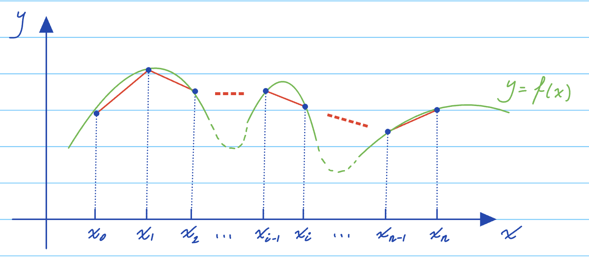

## Chapter 4: Interpolation

**Problem:** Given \( n + 1 \) discrete data points \(\{(x_i, f_i)\}_{i=0}^n\) with \(x_i \neq x_j \ \forall \ i \neq j \), determine a continuous function \( y(x) \) that interpolates the data.
\[ y(x_i) = f_i \ \text{for} \ 0 \leq i \leq n \]

![Graph illustrating interpolation with points \( x_0, x_1, x_2, \ldots, x_n \) and the interpolating function \( y(x) \).]

**Reasons for interest in interpolation:**
- We may need to determine interpolated values at \( x \neq x_i \).
- We may need to differentiate or integrate the interpolating function as approximations of the exact derivatives & integrals of the true function \( f(x) \), usually unknown.

### §4.1 Polynomial interpolation

- We will use \( p(x) \) to denote a general polynomial.
- \(\mathbb{P}_m\) denotes the vector space of all polynomials of degree \(\leq m\).

#### §4.1.1 The Vandermonde Matrix

**Definition 4.1:** Given \( n + 1 \) discrete data points \(\{(x_i, f_i)\}_{i=0}^n\) with \( x_i \neq x_j \ \text{for} \ i \neq j \), the interpolating polynomial is the \( \mathbb{P}_n \) polynomial,
\[ y_n(x) = a_0 + a_1 x + a_2 x^2 + \ldots + a_n x^n \]
such that \( y_n(x_i) = f_i \ \text{for} \ 0 \leq i \leq n \).

Q: How to determine the interpolating polynomial?
**Algorithm 4.1 (Solving the Vandermonde system)**

Solving the \((n+1) \times (n+1)\) linear system:
\[
\begin{cases}
a_0 + a_1 x_0 + a_2 x_0^2 + \ldots + a_n x_0^n = f_0 \\
a_0 + a_1 x_1 + a_2 x_1^2 + \ldots + a_n x_1^n = f_1 \\
\vdots \\
a_0 + a_1 x_n + a_2 x_n^2 + \ldots + a_n x_n^n = f_n
\end{cases}
\]

If written in matrix form:
\[
\begin{pmatrix}
1 & x_0 & x_0^2 & \ldots & x_0^n \\
1 & x_1 & x_1^2 & \ldots & x_1^n \\
\vdots & \vdots & \vdots & \ddots & \vdots \\
1 & x_n & x_n^2 & \ldots & x_n^n
\end{pmatrix}
\begin{pmatrix}
a_0 \\
a_1 \\
\vdots \\
a_n
\end{pmatrix} = 
\begin{pmatrix}
f_0 \\
f_1 \\
\vdots \\
f_n
\end{pmatrix}
\]

\[
V \vec{a} = \vec{f}
\]

**Proposition 4.1.** The determinant of \( V \) is given by
\[
\text{det}(V) = \prod_{0 \leq i < j \leq n} (x_j - x_i)
\]

* See [HB] proposition 5.1.

**Theorem 4.1.** The interpolating polynomial \( p(x) \in \mathbb{P}_n \) given \(\{(x_i, f_i)\}_{i=0}^n\) exists and is unique.

* \(\text{det}(V) \neq 0 \implies V\vec{a} = \vec{f}\) has a unique solution.

We do not plan to solve \( V\vec{a} = \vec{f} \) in order to find the interpolating polynomial:
1. We would need \( O(n^3) \) flops.
2. \( V \) tends to be ill-conditioned:
   The condition number grows faster than exponentially as a function of \( n \).

Next up: standard ways of finding interpolating polynomials without solving any system.

### §4.1.2 Lagrange form

**Example 4.1:** We start with two points \((x_0, f_0)\) & \((x_1, f_1)\).

**Goal:** A polynomial \( p(x) \in \mathbb{P}_1 \) such that
\[
p(x_0) = f_0
\]
\[
p(x_1) = f_1
\]

The idea is to find a "smarter" basis of \(\mathbb{P}_1\) to represent the desired interpolating polynomial.

- **Previous basis:**
  \[
  \{M_0(x), M_1(x)\} = \{1, x\} \quad (\text{monomial basis})
  \]
  Any \(\mathbb{P}_1\) polynomial can be represented as
  \[
  p(x) = a_0 M_0(x) + a_1 M_1(x) = a_0 + a_1 x
  \]
  i.e. a linear combination of the basis polynomials.

  We try to find \(a_0, a_1\) by
  \[
  \begin{cases}
  p(x_0) = f_0 \\
  p(x_1) = f_1
  \end{cases}
  \]
  which yields a Vandermonde system.

- **Smarter basis:**
  \[
  \{l_0(x), l_1(x)\} \quad (\text{Lagrange basis})
  \]

  \[
  l_0(x) \in \mathbb{P}_1 \text{ such that } l_0(x_0) = 1, l_0(x_1) = 0
  \]
  \[
  l_1(x) \in \mathbb{P}_1 \text{ such that } l_1(x_0) = 0, l_1(x_1) = 1
  \]

  Via inspection, we may find:
  \[
  l_0(x) = \frac{x - x_1}{x_0 - x_1}
  \]
  \[
  l_1(x) = \frac{x - x_0}{x_1 - x_0}
  \]

Any \(\mathbb{P}_1\) polynomial can be represented as
\[
p_1(x) = a_0 l_0(x) + a_1 l_1(x)
\]
i.e. a linear combination of the basis polynomials.

With the Lagrange basis \(\{l_0(x), l_1(x)\}\), \(a_0\) and \(a_1\) are determined immediately:
\[
\begin{cases}
a_0 = f_0 \\
a_1 = f_1
\end{cases}
\]

**Example 4.2:** When we have 3 points \((x_0, f_0)\), \((x_1, f_1)\), \((x_2, f_2)\):

- \(\{l_0(x), l_1(x), l_2(x)\}\) are as follows:
  \[
  l_0(x) = \frac{(x - x_1)(x - x_2)}{(x_0 - x_1)(x_0 - x_2)}
 \begin{cases}
  l_0(x_0) = 1 \\
  l_0(x_1) = 0 \\
  l_0(x_2) = 0
  \end{cases}
  \]

  \[
  l_1(x) = \frac{(x - x_0)(x - x_2)}{(x_1 - x_0)(x_1 - x_2)}
  \begin{cases}
  l_1(x_0) = 0 \\
  l_1(x_1) = 1 \\
  l_1(x_2) = 0
  \end{cases}
  \]

  \[
  l_2(x) = \frac{(x - x_0)(x - x_1)}{(x_2 - x_0)(x_2 - x_1)}
  \begin{cases}
  l_2(x_0) = 0 \\
  l_2(x_1) = 0 \\
  l_2(x_2) = 1
  \end{cases}
  \]

- Any \(\mathbb{P}_2\) polynomial can be represented as
  \[
  p_2(x) = a_0 l_0(x) + a_1 l_1(x) + a_2 l_2(x)
  \]

  

Again, we trivially obtain
\[
\begin{cases}
a_0 = f_0 \\
a_1 = f_1 \\
a_2 = f_2
\end{cases}
\]

**Definition 4.2. (Lagrange form of the interpolating polynomial)**

The \( n+1 \) Lagrange polynomials for \(\{(x_i, f_i)\}_{i=0}^n\) are the \(\mathbb{P}_n\) polynomials that satisfy:
\[
l_i(x_j) = \begin{cases} 
1 & \text{if } i = j \\
0 & \text{otherwise}
\end{cases}
\]

Or equally: \( l_i(x_j) = \delta_{ij} \) (Kronecker symbol)
\[
\delta_{ij} = \begin{cases} 
1 & \text{if } i = j \\
0 & \text{otherwise}
\end{cases}
\]

- We can explicitly write out \( l_i(x) \):
  \[
  l_i(x) = \frac{(x - x_0)(x - x_1) \ldots (x - x_{i-1})(x - x_{i+1}) \ldots (x - x_n)}{(x_i - x_0)(x_i - x_1) \ldots (x_i - x_{i-1})(x_i - x_{i+1}) \ldots (x_i - x_n)}
  \]

  Or compactly:
  \[
  l_i(x) = \prod_{j=0, j \neq i}^n \frac{x - x_j}{x_i - x_j}
  \]

- The Lagrange form of the interpolating polynomial:
  \[
  l_n(x) = \sum_{i=0}^n f_i l_i(x)
  \]

**Example 4.3.** Given points \(\{(2, \frac{3}{2}), (3, 2), (5, 1)\}\)

We have:
\[
\begin{aligned}
l_2(x) &= f_0 l_0(x) + f_1 l_1(x) + f_2 l_2(x) \\
&= \frac{3}{2} \frac{(x - 3)(x - 5)}{(2 - 3)(2 - 5)} + 2 \frac{(x - 2)(x - 5)}{(3 - 2)(3 - 5)} + 1 \frac{(x - 2)(x - 3)}{(5 - 2)(5 - 3)} \\
&= \frac{3}{2} \frac{(x - 3)(x - 5)}{-3} + 2 \frac{(x - 2)(x - 5)}{-6} + \frac{(x - 2)(x - 3)}{6} \\
&= -\frac{x^2}{3} + \frac{13x}{6} - \frac{3}{2}
\end{aligned}
\]

### §4.1.3 Hermite interpolation

**Motivation:** When derivatives are given at interpolation points, we can seek a polynomial that interpolates both function values and the derivatives.

**Definition 4.3:** Given \(\{(x_i, f_i, f_i')\}_{i=0}^n\), the Hermite interpolating polynomial is the polynomial \( p(x) \in \mathbb{P}_{2n+1} \) such that:
\[
\begin{aligned}
p(x_i) &= f_i \quad & \text{\( n+1 \) conditions} \\
p'(x_i) &= f_i' \quad & \text{\( n+1 \) conditions}
\end{aligned}
\]
\[ 2n+2 \text{ conditions} \implies 2n+1 \text{ degrees} \]

**Example 4.4:** Consider \( n=1 \) with \((x_0, f_0, f_0')\) & \((x_1, f_1, f_1')\). Then we are looking for \( p(x) \in \mathbb{P}_3 = \mathbb{P}_{2n+1} \):
\[ p(x) = a_0 + a_1 x + a_2 x^2 + a_3 x^3 \]

Q: How to find these coefficients?
A: Find suitable bases as we did for the Lagrange form.

We look for \( h_0(x), h_1(x), \tilde{h}_0(x), \tilde{h}_1(x) \) such that:

\[
\begin{array}{c|c|c|c|c}
& \text{Value at } x_0 & \text{Value at } x_1 & \text{Derivative at } x_0 & \text{Derivative at } x_1 \\
\hline
h_0(x) & 1 & 0 & 0 & 0 \\
h_1(x) & 0 & 1 & 0 & 0 \\
\tilde{h}_0(x) & 0 & 0 & 1 & 0 \\
\tilde{h}_1(x) & 0 & 0 & 0 & 1 \\
\end{array}
\]

With \(\{h_0(x), h_1(x), \tilde{h}_0(x), \tilde{h}_1(x)\}\),
\[ 
p(x) = f_0 h_0(x) + f_1 h_1(x) + f_0' \tilde{h}_0(x) + f_1' \tilde{h}_1(x)
\]

Following the table above, we can find:
\[ 
\begin{aligned}
h_0(x) &= (1 - 2(x - x_0) l_0'(x_0)) l_0(x)^2 \\
h_1(x) &= (1 - 2(x - x_1) l_1'(x_1)) l_1(x)^2 \\
\tilde{h}_0(x) &= (x - x_0) l_0(x)^2 \\
\tilde{h}_1(x) &= (x - x_1) l_1(x)^2
\end{aligned}
\]
where \( l_0(x) \) & \( l_1(x) \) are Lagrange polynomials associated with \( x_0 \) & \( x_1 \).

Let's verify:

- \( h_0(x) \):
  \[
  \begin{aligned}
  h_0(x_0) &= (1 - 2(x_0 - x_0) l_0'(x_0)) l_0(x_0)^2 = l_0(x_0)^2 = 1 \\
  h_0(x_1) &= (1 - 2(x_1 - x_0) l_0'(x_0)) l_0(x_1)^2 = 0 \\
  h_0'(x) &= (1 - 2(x - x_0) l_0'(x_0)) \frac{d}{dx}(l_0(x)^2) + \frac{d}{dx}(1 - 2(x - x_0) l_0'(x_0)) l_0(x)^2 \\
  &= (1 - 2(x - x_0) l_0'(x_0)) 2 l_0(x) l_0'(x) \\
  h_0'(x_0) &= -2 l_0'(x_0) l_0(x_0)^2 + (1 - 2(x - x_0) l_0'(x_0)) 2 l_0(x_0) l_0'(x_0) = 0 \\
  h_1(x) &= -2 l_0'(x_0) l_0(x)^2 + (1 - 2(x_1 - x_0) l_0'(x_0)) 2 l_0(x) l_0'(x) = 0
  \end{aligned}
  \]

- \( \tilde{h}_0(x) \):
  \[
  \begin{aligned}
  \tilde{h}_0(x_0) &= (x_0 - x_0) l_0(x_0)^2 = 0 \\
  \tilde{h}_0(x_1) &= (x_1 - x_0) l_0(x_1)^2 = 0 \\
  \tilde{h}_0'(x) &= (x - x_0) 2 l_0(x) l_0'(x) + l_0(x)^2 \\
  \tilde{h}_0'(x_0) &= (x_0 - x_0) 2 l_0(x_0) l_0'(x_0) + l_0(x_0)^2 = 1 \\
  \tilde{h}_1(x) &= (x - x_0) 2 l_0(x) l_0'(x) + l_0(x)^2 = 0
  \end{aligned}
  \]

- \( h_1(x) \) and \( \tilde{h}_1(x) \) check out similarly.

**Definition 4.3. (Cont'd)**

In general, given \(\{(x_i, f_i, f_i')\}_{i=0}^n\), the Hermite interpolating polynomial is given by
\[
H_n(x) = \sum_{i=0}^n f_i h_i(x) + \sum_{i=0}^n f_i' \tilde{h}_i(x)
\]
where
\[
\begin{aligned}
h_i(x) &= (1 - 2(x - x_i) l_i'(x_i)) (l_i(x))^2 \\
\tilde{h}_i(x) &= (x - x_i) (l_i(x))^2
\end{aligned}
\]
Note that \(h_i(x), \tilde{h}_i(x) \in \mathbb{P}_{2n+1}\).

**Proposition 4.2.**

For a given \(\{(x_i, f_i, f_i')\}_{i=0}^n\) where \(x_i \neq x_j \ \forall \ i \neq j\), there exists a unique interpolating polynomial \(p(x) \in \mathbb{P}_{2n+1}\) such that
\[
\begin{aligned}
p(x_i) &= f_i \quad &i = 0, 1, \ldots, n \\
p'(x_i) &= f_i' \quad &i = 0, 1, \ldots, n
\end{aligned}
\]
And \(p(x) = H_n(x)\).

*Proof:*

Suppose there is another polynomial \(G(x) \in \mathbb{P}_{2n+1}\) such that
\[
\begin{aligned}
G(x_i) &= f_i \quad &i = 0, 1, \ldots, n \\
G'(x_i) &= f_i' \quad &i = 0, 1, \ldots, n
\end{aligned}
\]
then let \(R(x) = H_n(x) - G(x)\). We deduce that:
\[
\begin{aligned}
R(x_i) &= 0 \quad &i = 0, 1, \ldots, n \\
R'(x_i) &= 0 \quad &i = 0, 1, \ldots, n
\end{aligned}
\]

Thus \(R(x)\) can be written as
\[
R(x) = g(x) (x - x_0)^2 (x - x_1)^2 \ldots (x - x_n)^2 \quad \text{(degree \(2n+2\))}
\]

where \(g(x)\) must be a polynomial since \(R(x) = H_n(x) - G(x)\) is a polynomial.

### §4.1.4 Runge phenomenon

**Problem:** For \( n \geq 1 \), define \( h = \frac{b - a}{n} \)
\[ x_j = a + jh, \quad j = 0, 1, \ldots, n \]

Let \( p_n(x) \) be the interpolating polynomial of a continuous function \( f(x) \) at \( x_0, x_1, \ldots, x_n \).
*(The interpolating polynomial \( p_n(x) \) from Definition 4.1)*

Then we ask whether:
\[
\lim_{n \to \infty} \max_{a \leq x \leq b} |f(x) - p_n(x)| \stackrel{?}{=} 0
\]

**Answer:** Not necessarily; depends on \( f(x) \) & \([a, b]\)

- For \( e^x \) on \([1, 1]\) we do have the convergence.
- A famous example of divergence:
  \[
  f(x) = \frac{1}{1 + x^2} \text{ on } [-1, 1]
  \]

It can be shown that:
\[
\lim_{n \to \infty} \max_{|x| \leq 1} |f(x) - p_n(x)| = +\infty
\]

**How to avoid this?**

- Use specially designed non-equidistant interpolating nodes \(\Rightarrow\) Chebyshev nodes
- Use piecewise polynomial interpolation

*Demo plots for Runge phenomenon can be found on LEARN.*

### §4.2 Piecewise polynomial interpolation
#### §4.2.1 Piecewise linear interpolation

**Definition 4.4:** We define a set of \( n \) polynomials \( p_i(x) \), \( 1 \leq i \leq n \), where the domain of \( p_i(x) \) is \( I_i = [x_{i-1}, x_i] \):
\[
p_i(x) = \frac{x - x_{i-1}}{x_i - x_{i-1}} f_i + \frac{x_i - x}{x_i - x_{i-1}} f_{i-1}
\]

The interpolating piecewise polynomial \( p(x) \) is equal to \( p_i(x) \) on \( I_i = [x_{i-1}, x_i] \) for all \( 1 \leq i \leq n \).

- *(Covered later in the course)* Error estimate:
  \[
  |f(x) - p(x)| \leq \frac{(x_i - x_{i-1})^2}{8} \max_{x_{i-1} \leq t \leq x_i} |f^{(2)}(t)| \quad \text{for } x \in (x_{i-1}, x_i)
  \]

- With evenly spaced grid, convergence as \( n \to \infty \).

- Drawback: jagged edges on the interpolating curve.

#### §4.2.2 Spline interpolation

**Definition 4.5:** Given \(\{(x_i, f_i)\}_{i=0}^n\), \(p(x)\) is a degree \(k\) spline if:
1. \( p(x) \) is a piecewise \(\mathbb{P}_k\) polynomial on each interval \( I_i = [x_{i-1}, x_i] \).
   We denote \( p^{[i]}(x) \) as the restriction of \( p(x) \) on \( I_i \).

2. (Usual interpolantion condition) \[ p^{[i]}(x_{i-1}) = f_{i-1} \quad \text{and} \quad p^{[i]}(x_i) = f_i \]

3. (Smooth conditions) 
   For each interior node \( x_j \) \((1 \leq j \leq n-1)\),
   \[
   \begin{cases} 
   p^{[j]}(x_j) = p^{[j+1]}(x_j) \\
   p^{[j]'}(x_j) = p^{[j+1]'}(x_j) \\
   \vdots \\
   p^{[j](k-1)}(x_j) = p^{[j+1](k-1)}(x_j)
   \end{cases}
   \]
   
   where \( p^{[j](k-1)}(x_j) \) means the \((k-1)\)th derivative of the polynomial \( p^{[j]}(x) \) evaluated at \( x = x_j \).

*The notation is a bit confusing here:*
For example, \( p^{[j](k)}(x_j) \) means the \( k \)th derivative of the polynomial \( p^{[j]}(x) \) evaluated at \( x = x_j \).

**Back to Definition 4.5:**
- We have in total \( n(k+1) \) unknowns.
  - \( n \) subintervals with a \(\mathbb{P}_k\) polynomial on each.
  - Interpolation conditions give \( 2n \) equations.
  - Smoothness conditions give \( (n-1)(k-1) \) equations.
  - \((n-1)\) interior nodes with \((k-1)\) matching derivatives.
  
- Conditions so far:
  \[ 2n + (n-1)(k-1) = nk + n - k + 1 \]
  - We need \( k-1 \) more equations!
  \[ nk(k+1) - (nk + n - k + 1) = k - 1 \]

**Definition 4.5 (Cont'd)**

- Extra conditions on the boundary nodes \( x_0, x_n \) may provide \( (k-1) \) equations!

- We introduce three common types of boundary conditions.

- And we consider \( k = 3 \):
  - Cubic spline
  - Smooth
  - Degree not too high \(\Rightarrow\) avoid oscillations
  - We need two more conditions \((k-1)\).

(4) **Type I, free boundary conditions:**
   \[
   p^{[1]''}(x_0) = 0, \quad p^{[n]''}(x_n) = 0
   \]
   *(Second derivatives being zero at boundary nodes)*

**Type II, clamped boundary conditions:**
   \[
   p^{[1]'}(x_0) = f_0', \quad p^{[n]'}(x_n) = f_n'
   \]
   *(First derivatives specified at boundary nodes)*

**Type III, periodic boundary conditions:**
   \[
   p^{[1]'}(x_0) = p^{[n]'}(x_n), \quad p^{[1]''}(x_0) = p^{[n]''}(x_n)
   \]

   *If \( f_0 = f_n \), we may further impose that 1st & 2nd derivatives also match at end points.*

*Further read on spline interpolation: [KA] §3.7.*

**Example 4.5 (a cubic spline)**

Consider the following piecewise function
\[
p(x) = 
\begin{cases} 
2 + 3x^2 + ax^3 & x \in [-1, 0] \\
2 + bx^2 - x^3 & x \in [0, 1] 
\end{cases}
\]
For what values of \(a\) and \(b\) is \(p(x)\) a cubic spline with free boundary conditions for \(-1 \leq x \leq 1\)?

Let 
\[ 
\begin{aligned}
p^{[1]}(x) &= 2 + 3x^2 + ax^3 \\
p^{[2]}(x) &= 2 + bx^2 - x^3 
\end{aligned}
\]

\[
\begin{aligned}
p^{[1]'}(x) &= 6x + 3ax^2 \\
p^{[2]'}(x) &= 2bx - 3x^2
\end{aligned}
\]

\[
\begin{aligned}
p^{[1]''}(x) &= 6 + 6ax \\
p^{[2]''}(x) &= 2b - 6x 
\end{aligned}
\]

**Enforcing the 2nd order derivative smoothness condition at \( x = 0 \)**:
\[ 
p^{[1]''}(0) = p^{[2]''}(0) \implies 6 = 2b \implies b = 3 
\]

**Enforcing free boundary condition at \( x = -1 \)**:
\[ 
p^{[1]'}(-1) = 6 - 6a = 0 \implies a = 1 
\]

We also verify the 1st order derivative smoothness condition:
\[ 
p^{[1]'}(0) = 0 = p^{[2]'}(0) 
\]

and free boundary condition at \( x = 1 \):
\[ 
p^{[2]''}(1) = 2b - 6 = 0 
\]

The interpolation conditions are implicit in this question:
\[
\begin{cases}
p^{[1]}(-1) = 2 + 3 - a = 4 \\
p^{[1]}(0) = p^{[2]}(0) = 2 \\
p^{[2]}(1) = 2 + b - 1 = 4 
\end{cases}
\]

### 4.3 Error estimates of polynomial interpolation

**Theorem 4.2 (Error estimate of Lagrange form interpolating polynomial)**

Given \(\{(x_i, f_i)\}_{i=0}^n\) with \(a = x_0 < x_1 < \ldots < x_n = b\) and \(f(x)\) a real-valued function with \(n+1\) continuous derivatives on the interval \([a, b]\). Then for any \( t \in [a, b] \), there exists \(\xi_t \in [a, b]\) such that:
\[
f(t) - p_n(t) = \frac{(t - x_0) \ldots (t - x_n)}{(n+1)!} f^{(n+1)}(\xi_t)
\]
where \( p_n(x) \) is the \(\mathbb{P}_n\) interpolating polynomial as in Definition 4.1 (or equivalently Def. 4.2, the Lagrange form).

*Proof omitted. See [KA] Theorem 3.2.*

In light of Theorem 4.2, we can derive the following global error bound. For \( t \in [a, b] \),
\[
|f(t) - p_n(t)| \leq \frac{M_{n+1}}{(n+1)!} \max_{a \leq x \leq b} |(x - x_0)(x - x_1) \ldots (x - x_n)|
\]
where \( M_{n+1} = \max_{x \in [a, b]} |f^{(n+1)}(x)| \).

We can optimize the bound by choosing \(\{x_i\}_{i=0}^n\) such that 
\[
\max_{a \leq x \leq b} |(x - x_0) \ldots (x - x_n)|
\]
is minimized.

**Theorem 4.3**

Let \(a = -1, b = 1\). The set of nodes \(\{x_i\}_{i=0}^n\) such that
\[
\max_{a \leq x \leq b} |(x - x_0) \ldots (x - x_n)|
\]
is minimized is 
\[
x_i^* = \cos\left(\frac{(2i + 1)\pi}{2n + 2}\right), \quad i = 0, 1, \ldots, n \quad (\text{Chebyshev nodes}).
\]

Then
\[
\max_{a \leq x \leq b} |(x - x_0) \ldots (x - x_n)| = \frac{1}{2^{n}}.
\]
**Corollary 4.4 (Error estimate of piecewise linear interpolating polynomial)**

Let \( p(x) \) be the piecewise linear interpolating polynomial of \( f(x) \) on \( I = \bigcup_{i=1}^n I_i \) where \( I_i = [x_{i-1}, x_i] \). Then for any \( t \in I_i \) and \( x_{i-1} < t < x_i \), 
\[
|f(t) - p(t)| \leq \frac{(x_i - x_{i-1})^2}{8} \max_{x_{i-1} \leq x \leq x_i} |f''(x)|
\]

*Proof:* For any \( I_i = [x_{i-1}, x_i] \) and any \( t \in (x_{i-1}, x_i) \), due to Theorem 4.2, there exists \(\xi_t \in I_i\) such that:
\[
f(t) - p(t) = \frac{(t - x_{i-1})(t - x_i)}{2!} f''(\xi_t)
\]
Thus,
\[
|f(t) - p(t)| \leq \max_{x_{i-1} \leq x \leq x_i} \left| \frac{(x - x_{i-1})(x - x_i)}{2} \right| \max_{x_{i-1} \leq x \leq x_i} |f''(x)|
\]

Consider piecewise linear interpolation on equidistant nodes:
- \( x_i - x_{i-1} = h \quad \checkmark \quad 1 \leq i \leq n \)
- \( x_0 = a, x_n = b \)
- \( M = \max_{x \in [a,b]} |f''(x)| \)

Then:
\[
|f(t) - p(t)| \leq \frac{h^2}{8} M = O(h^2)
\]
